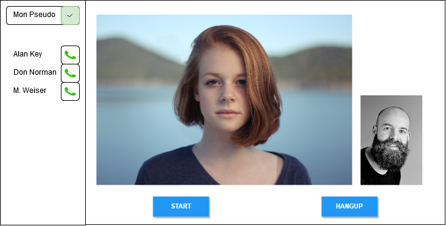

## TIW8 - TP3 Collaboration temps-réel 

#### Encadrants
- Aurélien Tabard (responsable)
- Lionel Médini
- Alix Ducros


### TP3.2 Visio p2p avec serveur

Le composant `Videochat` va beaucoup changer, plutôt que de le faire évoluer, **créez en un nouveau** repartant de l'ancien.

Vous pouvez supprimer les références à serversRef, client1 et client2, nous allons maintenant gérer les connexions de manière générique.

Faire une page d'accueil qui permette de basculer facilement vers un composant ou l'autre (pour la correction).

#### Class properties

Les `function components` sont utiles pour se forcer à ne pas gérer l'état dans ses composants de présentation.

Au court du TP nous allons utiliser des `Class components` pour gérer les routines de découverte et connexion liées à WebRTC qui elles vont devoir maintenir des états complexes. Pour cela nous allons utiliser les [`class properties` dans nos composants React](https://codeburst.io/use-class-properties-to-clean-up-your-classes-and-react-components-93185879f688), voir la documentation des classes

Dans votre fichier babel, rajouter le [plugin-proposal-class-properties](https://babeljs.io/docs/en/babel-plugin-proposal-class-properties) :

```js 
{
  "plugins": ["@babel/plugin-proposal-class-properties"]
} 
```

Plus d'information sur les [class fields](https://developer.mozilla.org/en-US/docs/Web/JavaScript/Reference/Classes/Class_fields) en ES6.

#### Mise en place d'un serveur

Nous allons utiliser une version légèrement modifiée du [code serveur](https://github.com/mdn/samples-server/blob/master/s/webrtc-from-chat/chatserver.js) de la [documentation MDN sur WebRTC](http://bit.ly/webrtc-from-chat), [téléchargeable ici](https://gist.github.com/Karalix/e68946d2c58680ec56c55b57c9765daf).


La commande `heroku logs` vous permet de récupérer les logs du serveur.

#### Signaling côté client

Voici une [classe qui permet de gérer le signaling côté client](../code/SignalingConnection.js).

Elle fait les choses suivantes : 

- crée un WebSocket avec `connectToSocket`,  
- configure des callbacks : `onOpen` quand la connexion démarre, `onMessage` quand on recoit des messages.
- `addMsgListener` permet d'ajouter des listeners de message au besoin.  
- `sendToServer` permet d'envoyer un objet json au serveur.

Nous allons utiliser cela pour orchestrer les clients qui participent à l'appel. 

Vous pouvez supprimer les fonctions associées à ICE dans votre composant principal (`onIceStateChange, onIceCandidate, onCreateOfferSuccess, onCreateAnswerSuccess`).


Au lieu d'utiliser un `componentDidMount` nous allons utiliser un `Effect Hook` pour créer la connexion au serveur de signaling au chargement du composant.

```js
    useEffect(() => {
        signalingConnection = new SignalingConnection({
            //socketURL: "localhost:3000",
            socketURL: window.location.hostname,
            onOpen: () => {console.log('signalingConnection open')},
            onMessage: onSignalingMessage
        });
    }, [])
```


Pour des raisons de simplicité lors du développement déclarez `signalingConnection` globalement (à l'extérieur du function component), vous pourrez refactorer plus tard.


Enfin il faudra construire au fur et à mesure du TP la fonction qui gèrera les différents signaux qui arrivent.
Observer les messages qui arrivent et maintenez un état cohérent entre les différents clients.

```js
    const onSignalingMessage = (msg) => {
        console.log('signaling message : ', msg)

        switch (msg.type) {
        }
    };
```


### Gérer plusieurs utilisateurs

Ces imports faits, nous allons maintenant rajouter un module dans l'interface pour gérer les noms d'utilisateurs, plutôt que de tout gérer en dur dans le code.

A la fin du TP, votre application devrait ressembler à ceci :



Faites en sorte qu'à l'ouverture de la page une instance de `SignalingConnection` soit créée. Lors de l'initialisation de l'objet `SignalingConnection`, le serveur sera contacté et renverra un message contenant l'identifiant unique correspondant au client. Gérez la réception de ce type de message dans le callback onMessage de `SignalingConnection`

```json
{
    "type":"id",
    "id":1576167442554
}
```

Conservez cet identifiant dans l'état de votre composant.

#### Créer son username

Ajoutez un champ de texte dans votre interface, qui vous permettra d'éditer l'username sous lequel vous souhaiterez apparaitre. Liez son contenu à votre état. Ajoutez aussi un bouton qui permet de valider votre username et de le déclarer au serveur de la manière suivante :


```js
    const pushUsername = () => {
        this.signalingConnection.sendToServer({
            name: username,
            date: Date.now(),
            id: clientID,
            type: "username"
        });
    };
```

Vous remarquerez la présence d'un clientID, c'est l'id attribué précédemment par le serveur. Veillez bien à ce qu'il ai la bonne valeur.

#### Afficher les utilisateurs connectés

A chaque fois que le serveur détectera un changement d'username d'un client, il envoie à tous une liste mise à jour de tous les utilisateurs qui peuvent être contactés. 

```json
{
    "type":"userlist",
    "users":[
        "Nova_Erdma",
        "Bob_Redant"
    ]
}
```

Sauvegardez ces données et affichez les sous forme de liste permettant de choisir l'utilisateur que vous voulez appeler :

```jsx
<p>{user} <Button onClick={() => {call(user)}} disabled={!callAvailable}>📞</Button></p>
```


### Etablissement de la connexion pair à pair

Pour démarrer, vous pourrez utiliser la classe [PeerConnection.js](../code/PeerConnection.js) qui se charge de gérer les routines liées aux connexions.

#### Initialisation de la connexion

En cas d'appel on rajoute le nom de la personne appelée comme target, et on initialise une PeerConnection.
```js
    const call = user => {
        targetUsername = user; // ref et non state
        createPeerConnection();
    };

    const createPeerConnection = () => {
        if (peerConnection) return;

        peerConnection = new PeerConnection({
            gotRemoteStream: gotRemoteStream,
            gotRemoteTrack: gotRemoteTrack,
            signalingConnection: signalingConnection,
            onClose: closeVideoCall,
            localStream: localStreamRef.current,
            username: username,
            targetUsername: targetUsername.current
        });
    };
```
Pour des raisons de simplicité lors du développement déclarez `peerConnection` globalement (à l'extérieur du function component), vous pourrez refactorer plus tard.

Pour pouvoir créer une `PeerConnection` vous aurez besoin de définir un ensemble de fonctions de gestion des flux vidéos.

```js
    const gotStream = stream => {
        localVideoRef.current.srcObject = stream;
        setCall(true);
        localStreamRef.current = stream;
    };
    const gotRemoteTrack = event => {
        let remoteVideo = remoteVideoRef.current;

        if (remoteVideo.srcObject !== event.streams[0]) {
            remoteVideo.srcObject = event.streams[0];
        }

        setHangup(true);
    };
    const gotRemoteStream = event => {
        let remoteVideo = remoteVideoRef.current;

        if (remoteVideo.srcObject !== event.streams[0]) {
            remoteVideo.srcObject = event.streams[0];
        }
    };
    
```

Vérifier que tout les messages de signaling passent bien lors de l'établissement de la connection. 

#### Etablissement de la connexion

Pour pouvoir établir votre connexion, il faudra gérer un *Interactive Connectivity Establishment*.

Pour cela il faut gérer les demandes de connexion, vous aller recevoir un `new-ice-candidate`, et en réaction l'ajouter à votre peerConnection. [En savoir plus](https://developer.mozilla.org/en-US/docs/Web/API/RTCIceCandidate)

```js
    case "new-ice-candidate": // A new ICE candidate has been received
        newICECandidate(msg)
        break;
```

```js
    const newICECandidate = ({candidate}) => {
        peerConnection.addIceCandidate(new RTCIceCandidate(candidate));
    }
```


#### Recevoir l'appel

Dans le cas ou vous recevez l'appel, il faut rajouter la gestion de l'invitation dans votre `onSignalingMessage`

```js 
    case "video-offer": // Invitation and offer to chat
        createPeerConnection();
        peerConnection.videoOffer(msg);
        break;
```


#### Etablir l'appel

Dans la gestion du signaling rajouter la gestion de l'appel.

```js
    case "video-answer": // Callee has answered our offer
        peerConnection.videoAnswer(msg);
        break;
```


#### Raccrocher et clore l'appel

En cas de clic sur le bouton "raccrocher" :

1. Envoyer un message "hang-up" au signaling serveur `signalingConnection.sendToServer{(...)}`
2. Fermer le peerConnection

Pour la personne à l'autre bout de l'appel, rajouter la gestion du `hang-up` dans le signaling :

```js
    case "hang-up": // The other peer has hung up the call
        close()
        break;
```

On ferme la connexion.
```js
    const close = () => {
        peerConnection.peerConnection.close();
        peerConnection.peerConnection = null;

        closeVideoCall();
    }
```

On ferme le flux vdéo.
```js
    const closeVideoCall = () => {
        remoteVideoRef.current.srcObject &&
            remoteVideoRef.current.srcObject
                .getTracks()
                .forEach(track => track.stop());
        remoteVideoRef.current.src = null;

        // TODO Mettre à jour l'état des boutons, et supprimer targetUsername.
    };    
```


### Refactoring 
Une grosse partie du code n'a pas sa place dans un composant sensé géré la vue.

Réorganisez tout cela pour avoir une helper class qui gère la logique de connexion.


#### FIN

Vous pouvez maintenant tester, nettoyer le code, et le rendre.

## Rendu

À rendre pour le dimanche 15 décembre à 23h59.

1. Déployez votre code sur Heroku
2. Pousser votre code sur la forge
3. Déposer les liens sur Tomuss "UE-INF2427M Technologies Web Synchrones Et Multi-Dispositifs"

- Le lien vers Heroku pointe vers une page fonctionelle
- Le lien vers la forge permet de faire un clone (format suivant: https://forge.univ-lyon1.fr/xxx/tiw8-tp3.git)


### Critères d'évaluation

malus si pas fait : 
- Fichier `README.md` décrivant le process de build en dev, en prod, et de déploiement.
- Fichier `package.json` nettoyé ne contenant que les dépendances nécessaires.
- Déploiement sur Heroku

40 % : 
- Visio locale (TP1) 

30 % :
- Partage des noms via le signaling (TP2)

20 % :  
- Visio fonctionelle (TP2 - difficile)

10 % 
- Qualité globale du rendu (= application qui ressemble à quelque chose, un minimum de mise en page, orthographe propre, composants s'appuyant sur des librairies CSS ou stylés à la main).
- Linting
- Respect des principes de programmation React (utilisation des etat et des references, des idiomes, etc.)
