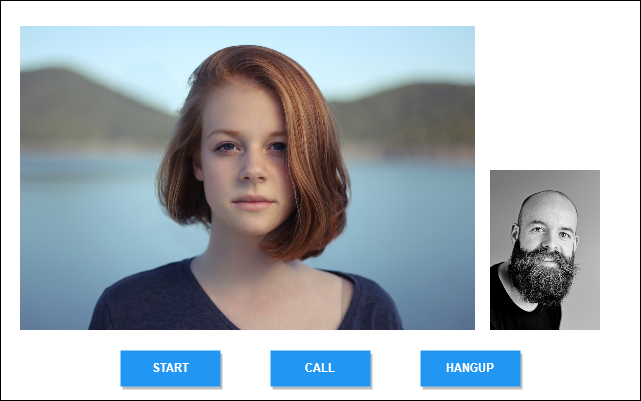
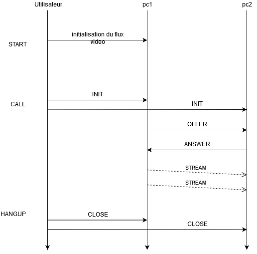

## TIW8 - TP3 Collaboration temps-réel 

#### Encadrants
- Aurélien Tabard (responsable)
- Lionel Médini
- Alix Ducros


#### Présentation du TP

L'objectif du TP est de mettre en place une Single Page Application (SPA) permettant à deux navigateurs de commencer une conversation via chat vidéo.

Ce TP s'étalera sur 2 séances et fera l'objet d'un rendu en binome et d'une note. 

Vous ferez le rendu sur la forge.


## TP3.1 WebRTC et vidéo en local

### Boilerplate

Repartez de votre projet du TP1. Ou utilisez react-create-app pour générer un nouveau projet.

Vérifiez que vous arrivez à lancer une page hello world avec un serveur node basique comme dans le TP1.

Vérifiez que votre déploiement sur Heroku fonctionne.

### Démarrage du TP
Nous allons créer une application qui permette de faire une visio entre deux navigateurs.

Elle ressemblera à cela : 



Nous allons nous appuyer sur WebRTC pour réaliser cela. WebRTC est une technologie p2p.

Nous aurons avoir : 
- un serveur 
  - pour fournir le site de base
  - pour permettre la découverte des clients du réseau p2p
- des clients qui se parleront entre eux.


### Création d'un composant dédié 

Avec les dernières versions de React, et notamment l'introduction des [hooks](https://reactjs.org/docs/hooks-intro.html) permettent de gérer des états dans les Function Components.
Au sein d'un composant React, on peut manipuler l'état avec `useRef` ou `useState`, [lire ici pour savoir lequel utiliser](https://www.codebeast.dev/usestate-vs-useref-re-render-or-not/)

Créez un composant React permettant de visualiser :
- le flux vidéo local
- le flux vidéo du correspondant
- un bouton démarrant la capture du flux vidéo local
- un bouton démarrant l'appel avec le correspondant
- un bouton mettant fin à l'appel
    
```js
const Videochat = () => {
        
    const [startAvailable, setStart] = useState(true)
    const [callAvailable, setCall] = useState(false)
    const [hangupAvailable, setHangup] = useState(false)

    return (
        <div>
            <video
                ref={localVideoRef}
                autoPlay
                muted
                style={{ width: "240px", height: "180px" }}
            />
            <video
                ref={remoteVideoRef}
                autoPlay
                style={{ width: "240px", height: "180px" }}
            />

            <ButtonToolbar>
                <Button onClick={start} disabled={!startAvailable}>
                    Start
                </Button>
                <Button onClick={call} disabled={!callAvailable}>
                    Call
                </Button>
                <Button onClick={hangUp} disabled={!hangupAvailable}>
                    Hang Up
                </Button>
            </ButtonToolbar>
        </div>
    )
}
```


### Récupération du flux vidéo

Pour pouvoir le transmettre à notre correspondant, nous allons tout d'abord faire en sorte de récupérer le flux vidéo du navigateur, lorsqu'on clique sur `Start`

Utilisez l'API mediaDevices pour récupérer le `stream` vidéo et le visualiser dans votre composant.

```js
    const start = () => {
        setStart(false)
        navigator.mediaDevices
            .getUserMedia({
                audio: true,
                video: true
            })
            .then(gotStream)
            .catch(e => {console.log(e); alert("getUserMedia() error:" + e.name)})
    }
 
    const gotStream = stream => {
        localVideoRef.current.srcObject = stream
        setCall(true) // On fait en sorte d'activer le bouton permettant de commencer un appel
        localStreamRef.current = stream
    }
```


### Établissement de la connexion

Dans un premier temps, pour plus de simplicité, nous allons nous concentrer à établir une connexion WebRTC entre 2 peers sur une même page web. Tout au long du TP, n'hésitez pas à vous référer à la documentation de [RTCPeerConnection](https://developer.mozilla.org/en-US/docs/Web/API/RTCPeerConnection).
Le fonctionnement peut être résumé par le diagramme suivant :



Le click sur le bouton `Call` initiera la connexion entre les [`RTCPeerConnection`](https://developer.mozilla.org/fr/docs/Web/API/RTCPeerConnection/RTCPeerConnection) pc1 et pc2. Les étapes à suivre seront détaillées dans les parties qui vont suivre :

- pc1 veut communiquer avec pc2, il va créer une Offre
- si l'Offre est correctement créée (`onCreateOfferSuccess`), on met à jour les connexions et pc2 va créer une Réponse
- si la Réponse est correctement créée (`onCreateAnswerSuccess`), on peut finaliser le handshake entre les 2 connexions
- enfin, quand le handshake est terminé, le callBack `gotRemoteStream` est appelé et diffuse le stream vidéo

```js
    const call = () => {
        setCall(false);
        setHangup(true);
 
        client1Ref.current = new RTCPeerConnection(serversRef.current);
        client2Ref.current = new RTCPeerConnection(serversRef.current);
        
        client1Ref.current.onicecandidate = e => onIceCandidate(client1Ref.current, e);
        client1Ref.current.oniceconnectionstatechange = e => onIceStateChange(client1Ref.current, e);
        
        client2Ref.current.onicecandidate = e => onIceCandidate(client2Ref.current, e);
        client2Ref.current.oniceconnectionstatechange = e => onIceStateChange(client2Ref.current, e);
        client2Ref.current.ontrack = gotRemoteStream;
 
        localStreamRef.current
            .getTracks()
            .forEach(track => client1Ref.current.addTrack(track, localStreamRef.current));
 
        client1Ref.current.createOffer({
                offerToReceiveAudio: 1,
                offerToReceiveVideo: 1
            })
            .then(onCreateOfferSuccess, error =>
                console.error(
                    "Failed to create session description",
                    error.toString()
                )
            );
 
    }; 
```

Dans le code ci-dessus, les 2 connexions (pc1 et pc2) voient certains de leurs listeners configurés : `onIceCandidate` leurs permettra de se connecter l'un à l'autre, `onIceStateChange` ne sera utilisé que pour afficher des infos de debug. `gotRemoteStream` s'occupera d'afficher dans le bon element `<video>`.

pc1 récupère toutes les tracks du flux vidéo et audio local et en créée une Offre.

### onCreateOfferSuccess
Quand pc1 aura réussi à créer une Offre, on met à jour chacune des connexions respectivement avec `setLocalDescription` pour pc1 et `setRemoteDescription` pour pc2.


```js
const onCreateOfferSuccess = desc => {     

        client1Ref.current.setLocalDescription(desc).then( () =>
          console.log("pc1 setLocalDescription complete createOffer"),
          error =>
              console.error(
                  "pc1 Failed to set session description in createOffer",
                  error.toString()
              )
        );
      
        client2Ref.current.setRemoteDescription(desc).then( () => {
          console.log("pc2 setRemoteDescription complete createOffer");
          client2Ref.current.createAnswer()
              .then(onCreateAnswerSuccess, error =>
                  console.error(
                      "pc2 Failed to set session description in createAnswer",
                      error.toString()
                  )
              );
          },
          error =>
              console.error(
                  "pc2 Failed to set session description in createOffer",
                  error.toString()
              )
        );
      };
```

Dans le code ci-dessus pc1 et pc2 mettent à jour leurs descriptions (qui sont des propriétés de la connexion ou le format utilisé pour les flux, etc.) et pc2 renvoie une Réponse qui va en quelque sorte accepter l'Offre faite par pc1.


### onCreateAnswerSuccess
Quand la Réponse de pc2 est créée avec succès, on recommence un round de configuration de desciption, cette fois dans l'autre sens.


```js
    const onCreateAnswerSuccess = desc => {
 
        client1Ref.current.setRemoteDescription(desc)
            .then(() => console.log("client1 setRemoteDescription complete createAnswer"),
                error => console.error(
                        "client1 Failed to set session description in onCreateAnswer",
                        error.toString()
                    )
            );
 
        client2Ref.current.setLocalDescription(desc)
            .then(() => console.log("client2 setLocalDescription complete createAnswer"),
                error => console.error(
                        "client2 Failed to set session description in onCreateAnswer",
                        error.toString()
                    )
            );
    };
```

### onIceCandidate

Une fois que les connexions se sont synchronisées avec les étapes précédentes, elles vont détecter qu'elle ont chacune un candidat ICE viable. On peut alors finaliser la mise en communication des deux : 

```js
    const onIceCandidate = (pc, event) => {
        console.log("!!!!pc")
        console.log(pc)
        let otherPc = pc === client1Ref ? client2Ref.current : client1Ref.current;
 
        otherPc
            .addIceCandidate(event.candidate)
            .then(
                () => console.log("addIceCandidate success"),
                error =>
                    console.error(
                        "failed to add ICE Candidate",
                        error.toString()
                    )
            );
    };
```

### Raccrocher
Il suffit d'appeler la méthode `close()` sur chacune des connexion.

```js
    const hangUp = () => {
 
        client1Ref.current.close();
        client2Ref.current.close();

        client1Ref.current = null;
        client2Ref.current = null;

        setHangup(false)
        setCall(true)
    };
```