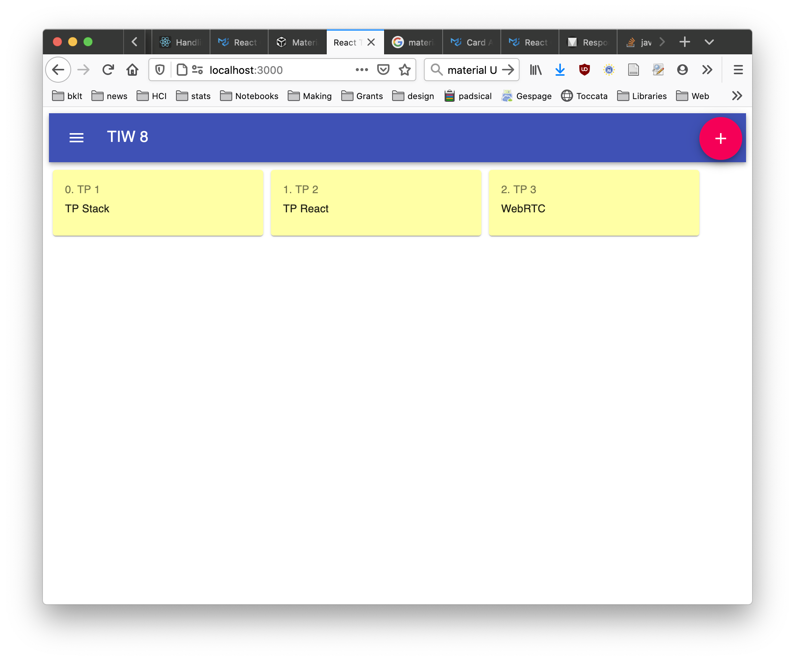
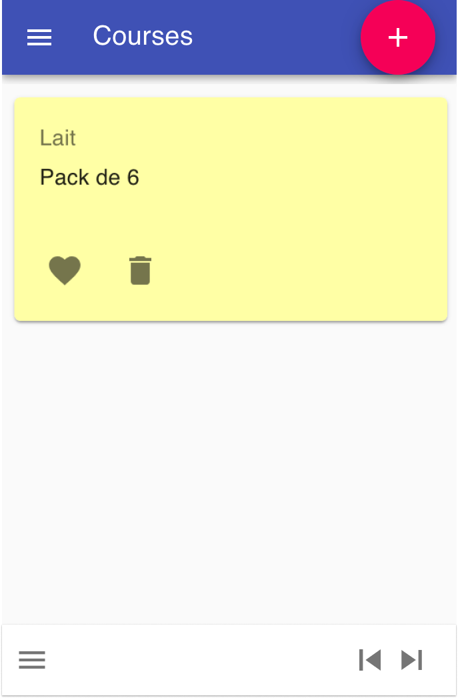

## TIW8 - TP2 Application de Présentation multi-surface en React

#### Encadrants

- Aurélien Tabard (responsable)
- Lionel Médini

#### Présentation du TP

L'objectif du TP est de mettre en place une Single Page Application (SPA) permettant de gérer des murs de post-its virtuels. Elle sera développée principalement côté client avec React, avec un serveur Node/Express léger. Client et serveur seront codés en JavaScript.

Les points suivants seront abordés

- Composants React
- Gestion des états et flux de données
- Gestion de routes React
- Redux pour la gestion avancée des états
- Middleware pour gérer des effets de bord
- Design responsif et adaptatif
- Reconnaissance de gestes

Ce TP s'étalera sur 4 séances et fera l'objet d'un rendu en binôme et d'une note. Voir les critères d'évaluation en bas de la page.

Vous ferez le rendu sur la forge, créez un projet git dès maintenant, puis un projet (npm init).

Pensez à remplir les champs de rendu sur Tomuss.

#### Quelques pointeurs vers la doc React

- [Introduction à la structuration d'application React](https://reactjs.org/docs/thinking-in-react.html)
- [Components and Props](https://reactjs.org/docs/components-and-props.html)
- [Hooks at a Glance](https://reactjs.org/docs/hooks-overview.html)
- [En quoi les fonctions composants sont-elles différentes des classes ?](https://overreacted.io/fr/how-are-function-components-different-from-classes/)
- [MaterialUI](https://material-ui.com/)

## TP2.1 Introduction à React

Nous allons repartir du TP1 pour ce projet, vous pouvez donc le cloner, puis le pousser dans un nouveau repo dédié au TP2 (pour les 4 séances du TP).

Si vous n'avez pas utilisé [material-ui](https://material-ui.com/) dans le TP précédent. Installez le.

### Structurer une application React en composants

Lire l'[introduction à la structuration d'application React](https://reactjs.org/docs/thinking-in-react.html).

Nous allons commencer par créer un squelette d'application statique, nous rajouterons les parties dynamiques par la suite.

L'application est composée de plusieurs murs. À chaque mur on peut ajouter des posts-its.
Les post-its ont un certain nombre de propriétés : couleur, contenu (texte, image, dessin à la main), position, taille, auteur, ... Vous pourrez par exemple vous inspirer de padlet ou de nombreux services équivalents.


Imaginez que le serveur envoie ce type de données (qui peuvent être améliorées/modifiées selon vos besoins) :

```javascript
[
  {
    type: "board",
    id: "1",
    title: "TIW 8",
    notes: ""
    postits:[
      {
        type: "postit",
        board: "1",
        title: "TP 1",
        text: "Le TP porte sur des rappels de developpement Web",
        visible: false,
        color: "#CCC",
      },
      {
        type: "postit",
        board: "1",
        title: "TP 2",
        text: "Le TP porte sur la creation d'un outil de presentation HTML",
        visible: true,
        color: "#00E",
      },
      {
        type: "postit",
        board: "1",
        title: "TP 3",
        text: "Le TP 3",
        visible: true,
        color: "#00E",
      },
      {
        type: "postit",
        board: "1",
        title: "TP 4",
        text: "Le TP 4",
        visible: true,
        color: "#0E0",
      },
    ]},
  {
    type: "board",
    board: "2",
    title: "Courses",
    notes: "",
    postits: [],
  },
]
```

Créez la structure des composants correspondant à cette application, en suivant le guide et l'exemple de [Thinking in React](https://reactjs.org/docs/thinking-in-react.html#step-1-break-the-ui-into-a-component-hierarchy).

Voici une structure pour démarrer, basée sur des composants material-ui.


Pour démarrer voilà un `index.jsx` le reste des composants que vous allez créer est rangé dans un sous-dossier `components`.

```JSX
import React from 'react';
import ReactDOM from 'react-dom';
import Board from './components/Board';
import AppToolbar from './components/AppToolbar';

function App() {
  const [boards, setBoards] = React.useState(DONNEES_CI_DESSUS);


  return (
    <div className="app">
      <AppToolbar boards={boards} index={0} />
      <Board board={boards} index={0}/>
    </div>
  );
}

ReactDOM.render(<App />, document.getElementById('root'));
```

Ce code est donné à titre indicatif. Commencez progressivement et testez régulièrement.

### Créer des composants passifs

Créer des composants fonctionnels passifs (on rajoutera de l'interaction par la suite. Vous pouvez vous inspirer de la syntaxe et de la structure de cette <a href="https://www.digitalocean.com/community/tutorials/how-to-build-a-react-to-do-app-with-react-hooks">mini todo app</a>

Vous allez vous rendre compte rapidement que votre linter râle. En effet, il veut pouvoir vérifier les types qui sont passés en props entre composants. Installez le module `prop-types` et lisez <a href="https://fr.reactjs.org/docs/typechecking-with-proptypes.html">la page suivante pour comprendre comment specifier les types de vos props</a>.

Il peut être pratique de désactiver temporairement eslint pour faire des tests incrémentaux. Cela peut se faire en mettant **temporairement** `/* eslint-disable */` en haut d'un fichier (ou via votre fichier .eslint). Corrigez bien toutes vos erreurs. Elles ne sont signalées par hasard (les désactivations seront pénalisées au moment du rendu).

### Gérer la logique de l'application

La toolbar doit afficher le titre du mur et un menu permettant de naviguer entre tous les murs. Rajouter à l'état de l'App, une balise indiquant le mur courant. Faites en sorte que l'état de App change lorsque vous sélectionnez un mur, et que ce changement d'état soit reflété au niveau de l'application. Pour cela il va falloir ajouter un flux inverse (faire en sorte que le menu parle à des composants parents).
Suivez les instructions et l'exemple de [Thinking in React](https://reactjs.org/docs/thinking-in-react.html#step-5-add-inverse-data-flow) sur les "Inverse Data Flow".

Pour comprendre comment cela fonctionne avec des functionals components et non des class components [référez vous à l'exemple de todo app mentionné plus haut](https://www.digitalocean.com/community/tutorials/how-to-build-a-react-to-do-app-with-react-hooks#step-5-%E2%80%94-updating-to-do-items)

Pour démarrer vous pouvez utiliser l'extension react dev tools, et modifier l'état à la main pour vérifier que la vue change bien.

### React Router

Pour terminer ce TP nous allons rajouter la gestion de routes, pour qu'il soit possible d'avoir un chemin dédié à chaque mur.
En plus d'avoir un état interne à l'application pour savoir quel post-it afficher, nous allons utiliser une route qui pointe vers le mur en question. En chargeant cette route, l'état sera modifié.

Nous allons utiliser [react-router](https://reacttraining.com/react-router/). Pour en comprendre la logique (et les différences avec d'autres outils de routing), je vous invite à lire [cette page](https://reacttraining.com/react-router/web/guides/philosophy).

[React router](https://reacttraining.com/react-router/web/guides/primary-components) requiert d'envelopper votre application dans un composant `Router`.

En l'occurrence `HashRouter` (et non `BrowserRouter` qui demande une configuration côté serveur). L'idée est que charger un url de type [http://monsite.net/#/3](http://monsite.net/#/3) charge le 3e mur. Importez bien `react-router-dom`.

<!-- Si vous utilisez des `class components`, vous pouvez récupérer la valeur de la route en utilisant un props dédié passé par le routeur. [Suivez cet exemple](https://reacttraining.com/react-router/core/api/withRouter) -->

Si vous utilisez des `functional components`, vous pouvez utiliser le hook `useParams();` pour récupérer des informations sur la route. [Suivez cet exemple](https://reacttraining.com/react-router/web/example/url-params). Vous pouvez aussi passer cette information with `routeProps`, du côté du composant parent [voir la documentation ici](https://reactrouter.com/web/api/Route/render-func).

```jsx
<Switch>
  <Route
    path="/:id"
    render={(routeProps) => <Board boards={boards} match={routeProps.match} />}
  />
</Switch>
```

Une fois la valeur de la route récupérée pour qu'il corresponde au mur à afficher. Vous remarquerez que la gestion de l'état courant est maintenant distribuée entre l'url et le state de React.

<!-- Puis implémenter une route et une n'affichant qu'un post-it. -->

<!-- Déployez et testez sur mobile (faites les adaptations nécessaires). -->

## TP2.2 Redux

Nous allons maintenant gérer l'état de l'application sur plusieurs dispositifs en utilisant Redux et des Websockets. L'objectif est que vous puissiez changer l'état de votre application de présentation sur un dispositif (ex: mobile), et que l'état de l'application soit mis à jour partout (ex: vidéo-projection, personne qui regarde votre mur à distance sur sa machine...)

<!-- Nous allons gérer l'état qui comprend la liste des murs et le mur en cours.-->

**Pensez à relire le cours et les ressources associées pour être au clair sur ce que vous êtes en train de faire.**

Afin de vous faciliter le debug du TP, vous pouvez activer la création d'un Source Map dans votre `webpack.config.js` : `devtool: 'eval-source-map'`.

### Redux

[Installez Redux et les dépendances associées pour React](https://redux-docs.netlify.com/introduction/installation) (`redux`, `react-redux`). Par défaut Redux n'est pas lié à React et peut être utilisé avec d'autres Framework.

Créez dans `src` des dossiers pour organiser votre `store`, vos `reducers`, `actions`, et `containers`.

#### Création d'un store

Nous allons commencer par créer le store qui va gérer les états.

```js
// src/store/index.js
import { createStore } from "redux";
import rootReducer from "../reducers/index";
const store = createStore(rootReducer);
export default store;
```

On importe `createStore` depuis redux et aussi `rootReducer`, on verra plus bas la définition des reducers.

`createStore` peut aussi prendre un état initial en entrée, mais c'est en React c'est les reducers qui produisent l'état de l'application (y compris l'état initial).

#### Création d'un reducer

On crée un premier reducer qui va initialiser l'application. Le `rootReducer` a un état initial constant (_immutable_) à compléter.

```js
    // src/reducers/index.js

    const initialState = {
      index: 1, // initialise votre presentation au mur 1
      boards: [] // vous pouvez réutiliser votre état de murs initial.
    };
    function rootReducer(state = initialState, action) {
    switch (action.type) {
        case CREATE_POSTIT:
            return ...
        case DELETE_POSTIT:
            return ...
        case CREATE_BOARD:
            return ...
        case DELETE_BOARD:
            return ...
        default:
            return state
    }
    return state;
    };
    export default rootReducer;
```

#### Tester Redux et le store

Dans votre `index.js` principal exposez le store pour pouvoir l'afficher via la console du navigateur.
Cela permettra d'effectuer les premiers tests de Redux, sans l'avoir branché à votre application React.

```js
import store from "./store/index"; // verifiez que le chemin est correct
window.store = store;
```

Un devtool pour Redux est disponible pour [Chrome](https://chrome.google.com/webstore/detail/redux-devtools/lmhkpmbekcpmknklioeibfkpmmfibljd) et [Firefox](https://addons.mozilla.org/en-US/firefox/addon/reduxdevtools/), il necessite quelques légères [modification de votre code](http://extension.remotedev.io/#11-basic-store).

#### Creation des actions

Suivre le [guide de Redux sur la création d'action](https://redux.js.org/basics/actions) en transposant la gestion de todos à la gestion de postits.

Vous aurez à définir les actions suivantes dans `actions/index.js`

```js
export const CREATE_BOARD = "CREATE_BOARD";
export const DELETE_BOARD = "DELETE_BOARD";
export const SET_BOARD = "SET_BOARD";
export const CREATE_BOARD = "CREATE_BOARD";

...
```

Ces actions sont utilisées comme signaux par Redux, ce ne sont que des objets JavaScript simples. C'est le Reducer qui va faire le travail.

Les actions forcent principalement à définir des traitement unitaire.

Une bonne pratique Redux consiste à envelopper les actions dans une fonction pour s'assurer que la création de l'objet est bien faite. Ces fonction s'appellent `action creator`.

```js
export function createBoard(payload) {
  return { type: CREATE_BOARD, payload };
}
```

Quand votre application deviendra plus complexe, vous pourrez utiliser la convention [Redux duck](https://github.com/erikras/ducks-modular-redux) pour organiser votre code. (pas la peine de faire ça maintenant)

#### Tester les actions

Toujours dans votre `index.js` principal, exposez les actions pour vérifier qu'elles changent bien le contenu du store.
Redux n'est toujours pas branché à React, il est donc normal que l'interface ne change pas pour le moment. Mais vous pouvez observer l'état via l'extension Redux ou un simple `console.log()` dans votre Reducer.

```js
import { createBoard } from "actions/index"; // verifiez que le chemin est correct
window.createBoard = createBoard;
```

#### Lien Redux / React

Nous allons lier votre composant principal à Redux.

Pour commencer `Redux` fournit un composant `<Provider>` à placer à la racine de votre application.

Voir l'[exemple de la documentation](https://react-redux.js.org/introduction/quick-start#provider).

Ce `provider` va rendre le store Redux disponible dans l'application.

Il faut ensuite ce connecter à ce store. Pour cela on utilise la fonction `connect()`, et en définissant une fonction `mapStateToProps()` qui va faire le lien entre le state Redux et les props de votre composant.

```js
const mapStateToProps = (state) => {
  return {
    boards: state.boards,
  }
}

... VOTRE_COMPOSANT ...

export default connect(mapStateToProps)(VOTRE_COMPOSANT)
```

Maintenant nous allons modifier l'état de `index` en cliquant sur les boutons précédent/suivant de votre `Toolbar`. Pour cela nous allons utiliser `mapDispatchToProps()` [qui va connecter notre application React aux actions Redux](https://react-redux.js.org/using-react-redux/connect-mapdispatch).

1. Importer connect de `react-redux`, et les actions depuis votre fichier de définition d'action.

```js
import { connect } from "react-redux";
import { action1, action2 } from "..../actions/index";
```

2. Créer un `mapDispatchToProps` et le connecter avec votre composant.

```js
const mapDispatchToProps = (dispatch) => {
  return {
    nextBoard: () => dispatch(nextBoard(true)),
    previousBoard: () => dispatch(previousBoard(true)),
  };
};
// ... VOTRE_COMPOSANT

export default withRouter(connect(null, mapDispatchToProps)(VOTRE_COMPOSANT));
```

3. Enfin en cas de clic sur vos boutons avant/apres appelez vos actions `onClick={() => {this.props.previousBoard}`

#### Lien Redux / React Router

Normalement l'intégration avec React Router se passe bien (pas de changements nécessaire). Si jamais ce n'était pas le cas, suivez l'utilisation de Redux avec React Router telle que présentée dans la documentation de [React Router](https://reacttraining.com/react-router/web/guides/redux-integration) ou celle de [Redux](https://redux.js.org/advanced/usage-with-react-router) pour configurer votre projet.

## TP2.3

## Distribution d’interface multi-dispositif Middleware et websockets

Nous allons maintenant travailler à la distribution de l'application sur plusieurs dispositifs et à leur synchronisation.

Nous allons définir une route pour chaque postit. Vous pouvez rajouter `postit` au chemin route pour basculer en mode édition de post-it.

Sur mobile l'interface ressemblera à ça :



Les boutons `<` et `>` permettent de naviguer entre les post-its. Le menu du haut pour naviguer entre les boards. Eventuellement un menu du bas pour naviguer entre post-its (optionnel).

### Définition de nouvelles routes et des vues associées

Il n'existe pas de bibliothèque à l'heure actuelle pour gérer de manière simple de la distribution d'interface, nous allons donc devoir le faire "à la main".

Rajouter des `Redirect` [(doc)](https://reacttraining.com/react-router/web/api/Redirect) à la racine de votre application pour faire une redirection vers une route en fonction du dispositif utilisé et de son état.

Vous pouvez utiliser `react-device-detect` [(doc)](https://www.npmjs.com/package/react-device-detect) pour détecter le dispositif (mobile ou non). Et la `fullscreen API` [(doc)](https://developer.mozilla.org/en-US/docs/Web/API/Fullscreen_API/Guide) pour contrôler le plein écran.

Déployez et tester.

### Gestion "à la main" des routes des Boards

Nous allons maintenant préparer la synchronisation des dispositifs. Pour cela nous allons devoir gérer le board courant dans notre état (`currentBoard` dans le store).
`ReactRouter` n'est pas conçu pour bien gérer le lien entre route et état. Et les routeur alternatifs (type `connected-react-router`) ont aussi des limites. Nous allons donc gérer cette partie de la route à la main.

#### Changer l'état à partir de la route

En écoutant l'évènement `popstate` nous pouvons êtres informé d'un changement dans l'url du navigateur. Si ce changement correspond à un changement dans l'index du board à afficher, nous allons déclencher l'action `setBoard`, avec l'index du board approprié.

```javascript
// Update Redux if we navigated via browser's back/forward
// most browsers restore scroll position automatically
// as long as we make content scrolling happen on document.body
window.addEventListener("popstate", () => {
  // `setBoard` is an action creator that takes
  // the hash of the url and pushes to the store it.

  // TODO add parsing and checks on the location.hash
  // to make sure it is a proper board index.
  boardIndex = window.location.hash;
  store.dispatch(setBoard(boardIndex));
});
```

Si vous n'avez pas encore définit l'action `setBoard`, créez le action creator correspondant, et le traitement associé dans le reducer.

#### Changer la route à partir de l'état

En écoutant les changements dans le store nous allons pouvoir être notifiés de changement de l'état et les répercuter dans la barre d'url (utile pour la suite, quand nous allons synchroniser des dispositifs):

```javascript
// The other part of the two-way binding is updating the displayed
// URL in the browser if we change it inside our app state in Redux.
// We can simply subscribe to Redux and update it if it's different.
store.subscribe(() => {
  const hash = "#/" + store.getState().currentBoard;
  if (location.hash !== hash) {
    window.location.hash = hash;
    // Force scroll to top this is what browsers normally do when
    // navigating by clicking a link.
    // Without this, scroll stays wherever it was which can be quite odd.
    document.body.scrollTop = 0;
  }
});
```

<!-- ### Refactorisation

Avant de passer à la suite, nous allons simplifier les ACTIONS de Redux. Supprimez les actions `NEXT_BOARD` et `PREVIOUS_BOARD` de votre liste d'actions et de votre Reducer. Aux endroits où ces actions étaient utilisées, remplacer par l'action `SET_BOARD` avec un changement de l'index courant. -->

### Middleware et websockets

Pour comprendre la logique du Middleware [suivez la documentation Redux](https://redux.js.org/advanced/middleware). Faites un essai qui reprend l'idée et logue dans la console toutes les actions déclenchées (voir [ici](https://redux.js.org/advanced/middleware#the-final-approach) _sans le crashReporter_).

Nous allons maintenant faire communiquer plusieurs navigateurs entre eux grâce à [socket.io](https://socket.io/). Pour cela nous allons rajouter un middleware dédié. Sur un navigateur, quand le board courant sera changé, un message sera envoyé aux autres navigateurs afin qu'ils changent eux aussi leur board courant.

Côté serveur, importez `socket.io` ([tuto officiel](https://socket.io/get-started/chat/)) et mettez en place le callback permettant de recevoir les messages `set_board` provenant d'un client et de les propager à tous les autres clients. Ce [guide permet de créer et tester une micro-application express utilisant socket.io](https://devcenter.heroku.com/articles/node-websockets#option-2-socket-io) en local et sur Heroku.

Côté client créez un [Middleware](https://redux.js.org/advanced/middleware#the-final-approach) dans lequel vous importerez `socket.io-client`. Le middleware devra, dès qu'il intercepte une action de type `SET_BOARD`, propager un message adéquat via le socket, avant de faire appel à `next(action)`

Toujours dans le middleware, configurez la socket pour qu'à la réception des messages `set_board`, les actions soient dispatchées au store.

```js
const propagateSocket = (store) => (next) => (action) => {
  if (action.meta.propagate) {
    if (action.type === SET_BOARD) {
      socket.emit("action", { type: "set_board", value: action.hash });
    }
  }
  next(action);
};
```

```js
socket.on("action", (msg) => {
  console.log("action", msg);
  switch (msg.type) {
    case "set_board":
      store.dispatch(setBoard(msg.value, false));
      break;
  }
});
```

Vous remarquerez sans doute qu'au point où nous en sommes nous allons provoquer une boucle infinie d'émissions de messages. Pour éviter cela, les actions `SET_BOARD` peuvent embarquer une information supplémentaire grâce [la propriété `meta`](https://github.com/redux-utilities/flux-standard-action#meta). Faites en sorte que seuls les dispatchs provenant d'un clic sur un bouton ou d'une modification de l'URL provoquent la propagation d'un message via Websocket.

N'oubliez pas d'utiliser `applyMiddleware` lors de la création du votre store. Si vous avez précédement installé le devtool Redux, référez-vous [à cette page](http://extension.remotedev.io/#12-advanced-store-setup) pour modifier de nouveau votre code.

```js
const composeEnhancers = window.__REDUX_DEVTOOLS_EXTENSION_COMPOSE__ || compose;

const store = createStore(
  rootReducer,
  composeEnhancers(applyMiddleware(propagateSocket))
);
```

## TP2.4 Modalité d’entrées (gestes, stylet)

### Gestion de modalités d'entrée

Nous allons maintenant ajouter des fonctions de dessin à nos post-its. En utilisant un stylet, un utilisateur pourra dessiner sur le post-it courant, et ce de manière synchronisée avec les autres appareils.

#### Création d'un canvas sur lequel dessiner

Pour cette partie, nous prendrons exemple sur ce tutoriel [W. Malone](http://www.williammalone.com/articles/create-html5-canvas-javascript-drawing-app/#demo-simple).

Dans un premier temps, dans le composant `Postit` ajoutez un élément `canvas` avec avec les handlers d'événements onPointerDown, onPointerMove et onPointerUp ainsi qu'en déclarant une [Référence React](https://reactjs.org/docs/hooks-reference.html#useref). Utilisez `useRef` si vous êtes dans un 'function component':

```jsx
<canvas
  className="stroke"
  ref={refCanvas}
  onPointerDown={pointerDownHandler}
  onPointerMove={pointerMoveHandler}
  onPointerUp={pointerUpEvent}
></canvas>
```

Ces handlers nous permettront d'écouter les événements provenant de `pointer`.

Afin de vous faciliter la tâche, voici le code _presque_ complet pour faire marcher le dessin sur le canvas.

Assurez-vous de bien faire les imports nécessaires au bon fonctionnement du code ci-dessous. Faites en sortes que l'on ne dessine que si c'est [un doigt ou un stylet qui est utilisé](https://developer.mozilla.org/en-US/docs/Web/API/PointerEvent/pointerType).

```js
var clickX = new Array();
var clickY = new Array();
var clickDrag = new Array();
var paint = false;

// Cette ligne permet d'avoir accès à notre canvas après que le composant aie été rendu. Le canvas est alors disponible via refCanvas.current
// Si vous utilisez des Class Components plutôt que des function Components, voir ici https://stackoverflow.com/a/54620836
let refCanvas = useRef(null);

function addClick(x, y, dragging) {
  clickX.push(x), clickY.push(y), clickDrag.push(dragging);
}

function redraw() {
  let context = refCanvas.current.getContext("2d");

  let width = refCanvas.current.getBoundingClientRect().width;
  let height = refCanvas.current.getBoundingClientRect().height;

  //Ceci permet d'adapter la taille du contexte de votre canvas à sa taille sur la page
  refCanvas.current.setAttribute("width", width);
  refCanvas.current.setAttribute("height", height);
  context.clearRect(0, 0, context.width, context.height); // Clears the canvas

  context.strokeStyle = "#df4b26";
  context.lineJoin = "round";
  context.lineWidth = 2;

  for (var i = 0; i < clickX.length; i++) {
    context.beginPath();
    if (clickDrag[i] && i) {
      context.moveTo(clickX[i - 1] * width, clickY[i - 1] * height);
    } else {
      context.moveTo(clickX[i] * width - 1, clickY[i] * height);
    }
    context.lineTo(clickX[i] * width, clickY[i] * height);
    context.closePath();
    context.stroke();
  }
}

function pointerDownHandler(ev) {
  console.error("ICI ON PEUT DIFFERENCIER QUEL TYPE DE POINTEUR EST UTILISE !");

  let width = refCanvas.current.getBoundingClientRect().width;
  let height = refCanvas.current.getBoundingClientRect().height;
  var mouseX = (ev.pageX - refCanvas.current.offsetLeft) / width;
  var mouseY = (ev.pageY - refCanvas.current.offsetTop) / height;

  paint = true;
  addClick(mouseX, mouseY, false);
  redraw();
}

function pointerMoveHandler(ev) {
  if (paint) {
    let width = refCanvas.current.getBoundingClientRect().width;
    let height = refCanvas.current.getBoundingClientRect().height;
    addClick(
      (ev.pageX - refCanvas.current.offsetLeft) / width,
      (ev.pageY - refCanvas.current.offsetTop) / height,
      true
    );
    redraw();
  }
}

function pointerUpEvent(ev) {
  paint = false;
}
```

### Lien du canvas au store

Dans votre rajoutez l'attribut `drawing` à chaque post-it :

```js
drawing: {
        clickX: [],
        clickY: [],
        clickDrag: []
    }
```

Et créez les actions `ADD_DRAW_POINTS` et `RESET_DRAW_POINTS`.

`ADD_DRAW_POINTS` devra accepter au moins 3 paramètres de type Array `(clickX, clickY, clickDrag)` qui seront concaténés à l'état du store.

`RESET_DRAW_POINTS` réinitialiseras les tableaux du store à vide.

Dans votre composant `Postit`, réalisez la connexion avec le store :

```js
const mapStateToProps = (state) => {
  return {
    drawing: state.drawing,
  };
};

const mapDispatchProps = (dispatch) => {
  return {
    addPoints: (x, y, drag) => dispatch(addDrawPoints(x, y, drag, true)),
  };
};
```

Une fois ceci fait, faites en sorte qu'à chaque fois qu'une ligne est finie de dessiner (`pointerUpEvent`), que vous copiez les points de la nouvelle ligne dans le store. Bien sûr, maintenant il faut aussi dessiner les lignes stockées dans le store (`props.drawing.`).

Sur mobile, ajoutez un bouton "Effacer" à votre toolbar, ce bouton déclenchera l'action `RESET_DRAW_POINTS`

### Synchronisation du canvas entre les appareils

Vous pouvez maintenant ajouter à votre Middleware de nouveaux cas permettant de propager les nouvelles lignes dessinées aux autres appareils.

```js
// ...
 else if (action.type === ADD_DRAW_POINTS) {
  socket.emit('action', {type: 'add_draw_points', value: {
      x: action.x,
      y: action.y,
      drag: action.drag
    }
  })
} else if (action.type === RESET_DRAW_POINTS) {
  socket.emit('action', {type: 'reset_draw_points'})
}
//...
```

Faites en sorte que tous les post-its affichent leurs dessins associés au chargement du board.

<!-- Vous remarquerez qu'à l'ouverture sur un autre appareil, votre dessin n'apparait que si vous dessinez aussi sur cet appareil. Pour remédier à ce problème, utilisez [useEffect](https://reactjs.org/docs/hooks-effect.html) afin d'exécuter `redraw()` au moment opportun. -->

### Reconnaissance de gestes

Pour terminer, nous allons effectuer de la reconnaissance de geste lors d'évènements touch.

Pour ce faire nous allons utiliser le [\$1 recognizer](http://depts.washington.edu/acelab/proj/dollar/index.html) vu en cours. Nous allons utiliser une version modifiée de [OneDollar.js](https://github.com/nok/onedollar-unistroke-coffee) pour fonctionner avec React. Il n'y a pas de module JS récent pour cette bibliothèque. Nous devrions donc le créer, mais pour plus de simplicité nous allons placer directement [la bibliothèque](../code/onedollar.js) dans le dossier `src/` pour qu'elle soit facilement bundlée par Webpack.

#### Gérer le recognizer

Au niveau de votre `Postit`, importer et initialiser votre le One Dollar Recognizer.

```js
// Voir ici pour le détails de options https://github.com/nok/onedollar-unistroke-coffee#options
const options = {
  score: 80, // The similarity threshold to apply the callback(s)
  parts: 64, // The number of resampling points
  step: 2, // The degree of one single rotation step
  angle: 45, // The last degree of rotation
  size: 250, // The width and height of the scaling bounding box
};
const recognizer = new OneDollar(options);

// Let's "teach" two gestures to the recognizer:
recognizer.add("triangle", [
  [627, 213],
  [626, 217],
  [617, 234],
  [611, 248],
  [603, 264],
  [590, 287],
  [552, 329],
  [524, 358],
  [489, 383],
  [461, 410],
  [426, 444],
  [416, 454],
  [407, 466],
  [405, 469],
  [411, 469],
  [428, 469],
  [453, 470],
  [513, 478],
  [555, 483],
  [606, 493],
  [658, 499],
  [727, 505],
  [762, 507],
  [785, 508],
  [795, 508],
  [796, 505],
  [796, 503],
  [796, 502],
  [796, 495],
  [790, 473],
  [785, 462],
  [776, 447],
  [767, 430],
  [742, 390],
  [724, 362],
  [708, 340],
  [695, 321],
  [673, 289],
  [664, 272],
  [660, 263],
  [659, 261],
  [658, 256],
  [658, 255],
  [658, 255],
]);
recognizer.add("circle", [
  [621, 225],
  [616, 225],
  [608, 225],
  [601, 225],
  [594, 227],
  [572, 235],
  [562, 241],
  [548, 251],
  [532, 270],
  [504, 314],
  [495, 340],
  [492, 363],
  [492, 385],
  [494, 422],
  [505, 447],
  [524, 470],
  [550, 492],
  [607, 523],
  [649, 531],
  [689, 531],
  [751, 523],
  [782, 510],
  [807, 495],
  [826, 470],
  [851, 420],
  [859, 393],
  [860, 366],
  [858, 339],
  [852, 311],
  [833, 272],
  [815, 248],
  [793, 229],
  [768, 214],
  [729, 198],
  [704, 191],
  [678, 189],
  [655, 188],
  [623, 188],
  [614, 188],
  [611, 188],
  [611, 188],
]);
```

#### Traitement différencié selon le type du pointerEvent.

Etendre les fonctions `pointerDownHandler`, `pointerMoveHandler`, `pointerUpHandler` pour qu'elles traite différemment les sources `touch`, `pen` et `mouse`.

Nous allons associer les gestes au `touch`. Toutefois pour débugger plus facilement, vous pouvez commencer traiter les gestes sur le pointerEvent `mouse`, et basculer sur le touch une fois que cela marche bien.

Similairement si vous n'avez pas de stylet à disposition, au lieu d'écouter `pen`, vous pouvez écouter des évènements `mouse` avec un modifieur (par exemple la touche `P` enfoncée). Mettez toutefois la condition dans le code avec un commentaire du type
`/* nous n'avions pas de stylet pour tester */`

Stocker les points composants le geste dans un Array `gesturePoints`.

#### Dessiner le geste

Dans la fonction de dessin `redraw` vous pouvez ajouter un cas à la fin qui dessine en cas de geste (les points composant le geste sont stockés dans `gesturePoints`).
Vous devrez être **vigilant à convertir vos points pour être dans le référentiel du canvas**, comme dans le code fournit ci-dessus.

```js
  function redraw(){

    ...

    if (gesture) {
      context.strokeStyle = "#666";
      context.lineJoin = "round";
      context.lineWidth = 5;

      context.beginPath();
      context.moveTo(gesturePoints[0][0]*width, gesturePoints[0][1]*height);
      for(var i=1; i < gesturePoints.length; i++) {
        context.lineTo(gesturePoints[i][0]*width-1, gesturePoints[i][1]*height);
      }

      context.stroke();
    }
  }
```

#### Reconnaitre un geste prédéfinit

Quand le geste se termine (`pointerUpHandler`), vous pouvez lancer la reconnaissance du geste.

```js
let gesture = recognizer.check(gesturePoints);
```

Inspectez l'objet gesture dans la console, et vérifiez que vous arrivez bien à reconnaitre un cercle et un triangle.

Pensez à réinitialiser `gesturePoints` une fois le geste terminé.

#### Apprendre de nouveaux gestes

Toujours dans `pointerUpHandler`, vous pouvez imprimer les trajectoires correspondants à des gestes.

```js
console.log("[[" + gesturePoints.join("],[") + "]]");
```

Utiliser cette sortie pour ajouter deux nouveaux gestes: '>' et '<' (partant du haut vers le bas) à votre recognizer.

#### Associer le geste à une action

Une fois le geste exécute, s'il correspond à un de ces deux nouveaux gestes (`recognized == true`), dispatcher les actions suivant ou précédent.

Pour faire cela, nous allons nous appuyer sur un `mapDispatchToProps` qu'il faudra connecter à votre composant.

```js
const matchDispatchProps = dispatch => {
  return {
    nextBoard: () => {
      dispatch(setBoard(store.getState().currentBoard+1, true))
      dispatch(resetDrawPoints(true))
    },
    previousBoard: () => {
      dispatch(setBoard(store.getState().currentBoard-1, true))
      dispatch(resetDrawPoints(true))
    },
    resetDrawPoints: () => dispatch(resetDrawPoints(true))
  }
```

`resetDrawPoints` est l'action associée à l'effaçage des dessins effectué sur le postit.

Vérifier que l'action est bien distribuée sur tous les dispositifs connectés.

#### FIN

Vous pouvez maintenant tester, nettoyer le code, et rendre.

## Rendu

À rendre pour le dimanche 15/11 à 23h59.

1. Déployez votre code sur Heroku
2. Pousser votre code sur la forge
3. Déposer les liens sur Tomuss :

- Le lien vers Heroku pointe vers le 1e board
- Le lien vers la forge permet de faire un clone (format suivant: https://forge.univ-lyon1.fr/xxx/yyy.git)

### Critères d'évaluation

- Fichier `README.md` décrivant le process de build en dev, en prod, et de déploiement.
- Fichier `package.json` nettoyé ne contenant que les dépendances nécessaires.
- Linting bien configuré et respecté
- Déploiement sur Heroku
- Composants React pour le `Board`, les `Postits`, la `Toolbar`.
- Utilisation de composants fonctionnels.
- Store qui contient l'état de l'application
- Le flux de données suit le flow React, des actions sont déclarées, et les changements d'états passent par des actions unitaires qui modifient le store.
- Les changements sont des fonctions qui renvoient un nouvel état (immutabilité) dans le reducer.
- Redux pour la gestion avancée des états
- Gestions des routes pour les boards et post-its
- Suivant/precedent change l'URI. Changer la route dans la barre d'URL du navigateur change l'état de l'application.
- Implémentation des Websockets côté client et serveur
- Synchronisation du board affiché entre les dispositifs s'appuyant sur un middleware
- Adaptation du contenu au dispositif (routage selon le dispositif) et affichage des bons composants.
- Gestion du plein écran.
- Gestion différenciée des pointer-events.
- Synchronisation des dessins s'appuyant sur un middleware.
- Gestion des gestes pour des commandes suivant, précédent.
- Les commandes associées aux gestes sont bien propagées et permettent de contrôler un dispositif à distance.
- Qualité globale du rendu (= application qui ressemble à quelque chose, un minimum de mise en page, orthographe propre, composants s'appuyant sur des librairies CSS ou stylés à la main).
