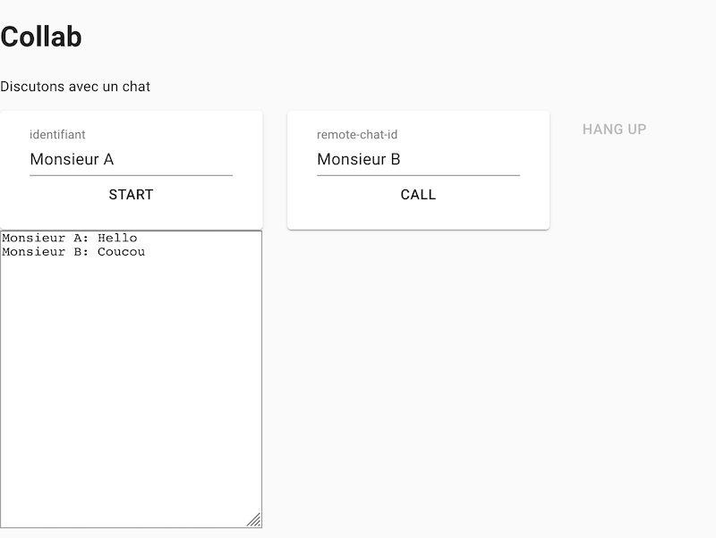

## TIW8 - TP3 Collaboration temps-réel

#### Encadrants
- Aurélien Tabard (responsable)
- Lionel Médini


#### Présentation du TP

L'objectif du TP est de mettre en place une Single Page Application (SPA) permettant à deux navigateurs de commencer une conversation via chat vidéo.

Ce TP s'étalera sur 2 séances et fera l'objet d'un rendu en binome et d'une note.

Vous ferez le rendu sur la forge.


## TP3.1 WebRTC et chat en local

### Boilerplate

Repartez de votre projet du TP1.

Vérifiez que vous arrivez à lancer une page hello world avec un serveur node basique comme dans le TP1.

Vérifiez que votre déploiement sur Heroku fonctionne.

On continuera d'utiliser ESlint.


### Démarrage du TP
Nous allons créer une application qui permet de faire un chat entre deux navigateurs.

Elle ressemblera à cela :



À la différence d'une application de chat "normale", ici les messages vont s'échanger entre les navigateurs sans passer par un serveur. Nous allons nous appuyer sur WebRTC pour réaliser cela. WebRTC est une technologie p2p.

Nous aurons :
- un serveur
  - pour fournir le site de base
  - pour permettre la découverte des clients du réseau p2p
- des clients qui se parleront entre eux.

Nous allons nous appuyer sur la [peer.js](https://peerjs.com/) pour réaliser ce TP. Cette bibliothèque abstrait une bonne partie de la complexité de WebRTC. Vous pouvez aller voir le [TP de l'année dernière](../../2019/TP3) pour avoir une idée de comment faire les choses "à la main".

On aura besoin des dépendances suivantes :
- material-ui (déjà utilisé au TP2)
- [peer.js](https://peerjs.com/)

### Création du composant parent

Nous allons créer un composant React qui va assembler les composants suivants :
- Un champ texte pour définir son identifiant
- Un champ texte pour spécifier l'identifiant du destinataire
- Un bouton pour démarrer la mise entre relation entre les deux clients
- Un champ texte pour saisir son message
- Un bouton pour envoyer les messages échangés
- Un div pour afficher les messages au fur et à mesure
- Un bouton mettant fin à la connexion

```js
function DataChat()  {

    const [startAvailable, setStart] = useState(true)
    const [sendAvailable, setSend] = useState(false)
    const [hangupAvailable, setHangup] = useState(false)

    return (
        // TODO rajouter les champs textes correspondants
        // Vous pouvez utiliser des TextField de material-UI
        // Et une Grid plutôt que des div pour la mise en page
        <div>
          <Button onClick={start} disabled={!startAvailable}>
            Start
          </Button>
          <Button onClick={send} disabled={!callAvailable}>
            Send
          </Button>
          <Button onClick={hangUp} disabled={!hangupAvailable}>
            Hang Up
          </Button>
        </div>
    )
}
export default DataChat
```

Vous devriez à ce stade avoir un cadre d'application non fonctionelle

### Mise en place d'un serveur

Comme dans les TP précédents nous allons utliser express.

Nous allons y adjoindre un serveur facilitant la découverte entre pairs.

Installez globalement peer : `npm install -g peer` (une installation locale devrait fonctionner aussi, je l'ai installé globalement car le module offre aussi la possibilité de lancer un serveur peer dédié en ligne de commande - indépendant d'express - ce qui était pratique pour le développement)

Voir [la documentation ici](https://github.com/peers/peerjs-server)

Voici à quoi votre serveur Express + Peer devrait ressembler :

```js
const express = require('express');
const http = require('http');
const path = require('path');
const app = express();
const server = http.createServer(app);
const { ExpressPeerServer } = require('peer');
const port = process.env.PORT || '3000';

const peerServer = ExpressPeerServer(server, {
  debug: true,
  path: '/mypeer',
});

app.use(peerServer);

const DIST_DIR = path.join(__dirname, '../dist');
app.use(express.static(DIST_DIR));

app.get('/', (request, response) => {
  response.sendFile(__dirname + '/index.html');
});

server.listen(port);
console.log('Listening on: ' + port);
```

Quand vous lancez le serveur vous pourrez vérifier que votre application React s'affiche bien sur [localhost:3000](localhost:3000) et que le serveur peer est actif sur [localhost:3000/mypeer](localhost:3000/mypeer)

### Mise en relation de deux clients

⚠️ ATTENTION ⚠️

Nous allons gérer pour ce qui a trait à peerJS à l'extérieur de nos composants React. En effet peerjs est une abstraction d'interfaces de communication réseau, il n'y a pas trop de raison de le gérer à l'interieur de l'état de notre application.

En vous référent à la [documentation de peerJS](https://peerjs.com/docs.html#peer) mettez en relation les deux clients.

Le déroulé est le suivant :
- Ouvrir deux fenêtres de navigateur sur votre application
- Remplir les champs d'dentifiants d'émetteur et de récepteur, pour qu'ils se correspondent entre les deux fenêtres.
- Lors du clic sur Start créez une connexion entre les deux clients (il faudra que les deux clients cliquent sur Start pour que la connexion soit établie). La création sera constituée des étapes suivantes
  - création/initialisation de l'objet Peer avec l'identifiant de votre client local.
  - ajout d'un listener d'ouverture de connexion (on open)
  - ajout d'un listener en cas de réception d'une demande de connexion (on connection)
  - connexion au client distant

```js
	// initialisation de votre objet Peer (à l'extérieur du composant)
  peer = new Peer(localID, {
    host: 'localhost',
    port: 3000,
    path: '/myapp',
  });
```
- Lors du clic sur Send, envoi du message.
- (Rajouter) un listener à la connexion sur l'arrivée d'un message (on data) pour l'ajouter à la liste des messages reçus.
- Lors du clic sur HangUp, femer la connexion


## TP3.2 WebRTC et vidéo

Nous allons maintenant créer un nouveau composant dédié à la vidéo.


Pour simplifier les choses je vous conseille de faire un Composant dédié qui a sa propre route.

Comme pour le TP précédent, nous allons démarrer par établir une connexion WebRTC entre 2 peers en local.


### Création du composant VideoChat

Nous allons reprendre le principe du DataChat, mais cette fois transmettre des flux vidéos plutôt que des data.

Nous allons créer un composant React qui va assembler les composants suivants :
- le flux vidéo local
- le flux vidéo du correspondant

- un champ d'identifiant de la personne distante

- un bouton démarrant la capture du flux vidéo local, et se déclarant au serveur.
- un bouton démarrant la connexion avec la personne.
- un bouton mettant fin à la connexion.

```js
function VideoChat()  {

    const [startAvailable, setStart] = useState(true)
    const [callAvailable, setCall] = useState(false)
    const [hangupAvailable, setHangup] = useState(false)

    return (
        <div>
          <video
            ref={localVideoRef} autoPlay muted
            style={{ width: '240px', height: '180px' }}
          >
            <track kind="captions" srcLang="en" label="english_captions"/>
          </video>
          <video
            ref={remoteVideoRef} autoPlay
            style={{ width: '240px', height: '180px' }}
          >
            <track kind="captions" srcLang="en" label="english_captions"/>
          </video>

          <div>
            <Button onClick={start} disabled={!startAvailable}>
              Start
            </Button>
            <Button onClick={call} disabled={!callAvailable}>
              Call
            </Button>
            <Button onClick={hangUp} disabled={!hangupAvailable}>
              Hang Up
            </Button>
          </div>
        </div>
    )
}
export default VideoChat
```

#### Identifiants des clients

Pour établir la connexion il va falloir gérer la gestion d'identifiants permettant de savoir qui sont les clients à mettre en relation.


### Récupération du flux vidéo

Avant de transmettre notre flux local à notre correspondant, nous allons tout d'abord faire en sorte de récupérer le flux vidéo du navigateur, lorsqu'on clique sur `Start`

Utilisez l'API mediaDevices pour récupérer le `stream` vidéo et le visualiser dans votre composant.

```js
    const start = () => {
        // TODO initialisation de peerjs

        setStart(false)
        navigator.mediaDevices
            .getUserMedia({
                audio: true,
                video: true
            })
            .then(gotStream)
            .catch(e => {console.log(e); alert("getUserMedia() error:" + e.name)})
    }

    const gotStream = stream => {
        localVideoRef.current.srcObject = stream
        setCall(true) // On fait en sorte d'activer le bouton permettant de commencer un appel
        localStreamRef.current = stream
    }
```

Plutôt que des déclarer des variables hors du scope du composant, comme au TP précédent, nous allons faire les choses plus proprement en déclarant certaines objets comme mutable et persistant tout au long du cycle de vie [grâce au hook useref](https://reactjs.org/docs/hooks-reference.html#useref).

Vous aurez globalement besoin de gérer trois objets (déclarer au début du composant après vos variables d'état) :

```js
  const localStreamRef = useRef();
  const localVideoRef = useRef();
  const remoteVideoRef = useRef();
```


### Établissement de la connexion

On établit la connexion de la même manière qu'au TP précédent.


#### Mise en relation des clients

Le click sur le bouton `Call` initiera la connexion entre les deux pairs.

Référez vous à la [documentation de peerjs](https://peerjs.com/) pour l'émission et la réception du flux vidéo.

Vous pourrez appelez `gotRemoteStream(stream_de_peerjs);` dans votre événement `on call` pour cabler le flux à l'interface.

```js
    const call = () => {
        // TODO voir la doc de peerjs

        setCall(false);
        setHangup(true);
    };
```

```js
const gotRemoteStream = (remoteStream) => {
  const remoteVideo = remoteVideoRef.current;

  if (remoteVideo.srcObject !== remoteStream) {
    remoteVideo.srcObject = remoteStream;
  }
};
```

### Raccrocher
Il suffit d'appeler la méthode `close()` sur chacune des connexion.


## Déployer sur Heroku

Pour terminer nous allons déployer le code sur Heroku. Pour cela nous allons utiliser un serveur peerjs dédié.

Vous pouvez [en déployer un par ici](https://elements.heroku.com/buttons/harshjv/peerjs-server).

Il faudra donc mettre à jour votre application en conséquence.

Vous pouvez faire du code code conditionnel et tester `location` côté client pour savoir si vous êtes en localhost ou déployé sur heroku, et parler à un serveur peer ou un autre en conséquence.

**Dans votre README préciser bien quelle type de configuration fonctionne.**

## Rendu

À rendre pour le dimanche 13 à 23h59.

  - Déployez votre code sur Heroku
  - Pousser votre code sur la forge
  - Déposer les liens sur Tomuss “UE-INF2427M Technologies Web Synchrones Et Multi-Dispositifs”

  - Le lien vers Heroku pointe vers une page permettant d'aller sur le composant de chaque TP (ou sur une version intégrant les deux).
  - Le lien vers la forge permet de faire un clone (format suivant: https://forge.univ-lyon1.fr/xxx/yyy.git)


## Evaluation

- rendu respectant les consignes (2pt)
- build correspondant aux instructions du TP1 (2pt)
- README clair sur les spécificité du projet (build, déploiement, ce qui marche et ce qui ne marche pas, sur comment tester...) (1pt)
- Des composants material (ou autre) sont utilisés de manière judicieuse (aka l'application ressemble à quelque chose) (2pt)
- DataChat (6pt)
  - signalement au serveur
  - établissement de la connexion entre les deux pairs
  - les deux pairs peuvent s'envoyer des messages
- DataChat (4pt)
  - le flux local s'affiche
  - le flux distant est bien récupéré
  - le flux distant s'affiche
  - le tout fonctionne en local
- Déploiement sur Heroku qui fonctionne (3pt)
