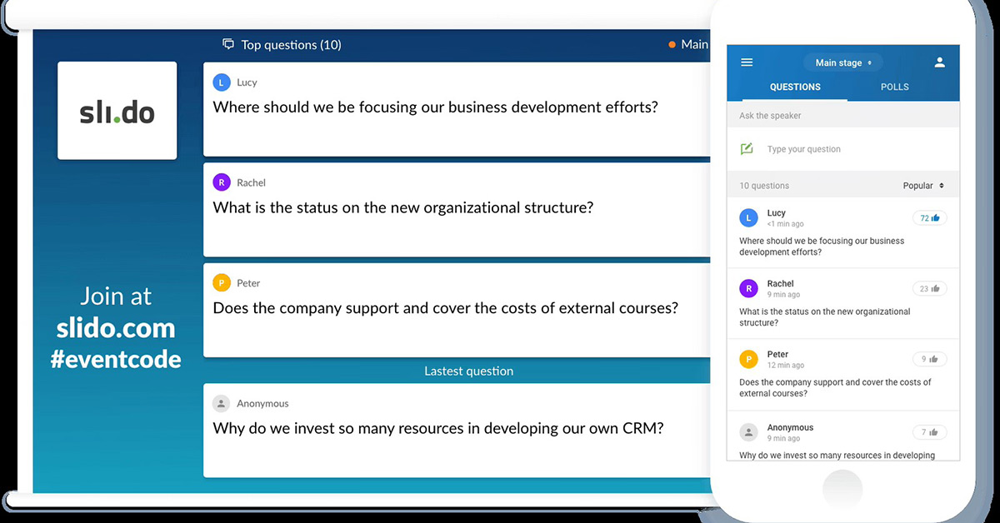

## TIW8 - TP2 Application de Présentation multi-surface en React

#### Encadrants

- Aurélien Tabard (responsable)

#### Présentation du TP

L'objectif du TP est de mettre en place une Single Page Application (SPA) permettant de gérer des sessions de questions/réponses, sondages en temps réel. Elle sera développée principalement côté client avec React, avec un serveur Node/Express léger. Client et serveur seront codés en Typescript.

Les points suivants seront abordés

- Composants React
- Gestion des états et flux de données
- Gestion de routes React
- Redux et Redux Toolkit pour la gestion avancée des états
- Middleware pour gérer des effets de bord
- Websockets et communication temps réelle entre dispositifs
- Design responsif et adaptatif
- Reconnaissance de gestes

Ce TP s'étalera sur 4 séances et fera l'objet d'un rendu en binôme et d'une note. Voir les critères d'évaluation en bas de la page.

Vous ferez le rendu sur la forge, créez un projet git dès maintenant.

Pensez à remplir les champs de rendu sur Tomuss.

#### Quelques pointeurs vers la doc React

- [Introduction à la structuration d'application React](https://reactjs.org/docs/thinking-in-react.html)
- [Components](https://react.dev/learn/your-first-component)
- [Passer des props à un composant](https://react.dev/learn/passing-props-to-a-component)

## TP2.1 Introduction à React

Nous allons repartir du TP1 pour ce projet, vous pouvez donc le cloner, puis le pousser dans un nouveau repo dédié au TP2 (pour les 4 séances du TP).

Vous pourrez utiliser Tailwind, [chakra-ui](https://chakra-ui.com/), [material-ui](https://material-ui.com/) ou autre.

Si vous avez des soucis avec Typescript et React, [regardez par ici](https://react-typescript-cheatsheet.netlify.app/)

### Structurer une application React en composants

Lire l'[introduction à la structuration d'application React](https://react.dev/learn/thinking-in-react).

Nous allons commencer par créer un squelette d'application statique, nous rajouterons les parties dynamiques par la suite.

L'application est composée de plusieurs événements, chacun composé de plusieurs questions/quizz. À évenement on peut ajouter des questions et réagir dessus.
Les questions ont un certain nombre de propriétés : couleur, contenu (texte, image, dessin à la main), position, taille, auteur, ... Vous pourrez par exemple vous inspirer de [slido](https://www.slido.com/) ou de nombreux services équivalents.



Imaginez que le serveur envoie [ce type de données](qa-data-structure.json) (qui peuvent être améliorées/modifiées selon vos besoins), voici une [version étendue](qa-expanded-data_2.json).

### Créer des composants passifs

Créez la structure des composants correspondant à cette application, en suivant le guide et l'exemple de [Thinking in React](https://react.dev/learn/thinking-in-react#step-1-break-the-ui-into-a-component-hierarchy).

Pour démarrer voilà un `index.tsx` le reste des composants que vous allez créer est rangé dans un sous-dossier `components`.

```tsx
import { createRoot } from 'react-dom/client'
import * as React from 'react'
import AppToolbar from './components/AppToolbar'
import EventPanel from './components/EventPanel'

const App = () => (
    <div>
        <AppToolbar />
        <EventPanel />
    </div>
)

const container = document.getElementById('root')!
const root = createRoot(container)
root.render(<App />)
```

Ce code est donné à titre indicatif vous pouvez reprendre ce que vous avez déjà créé dans le TP1, en faisant attention au typage des fonctions composant, de leurs paramètres (props). Commencez progressivement et testez régulièrement.

Créer des composants fonctionnels (on rajoutera de l'interaction par la suite). Vous pouvez vous inspirer de la syntaxe et de la structure de cette <a href="https://github.com/laststance/react-typescript-todomvc-2022">mini todo app</a>

### Gérer la logique de l'application

La toolbar doit afficher le titre de l'événement et un menu permettant de naviguer entre tous les événements. Rajouter à l'état de l'App, une balise indiquant le événement courant. Faites en sorte que l'état de App change lorsque vous sélectionnez un événement, et que ce changement d'état soit reflété au niveau de l'application. Pour cela il va falloir ajouter un flux inverse (faire en sorte que le menu parle à des composants parents).
Suivez les instructions et l'exemple de [Thinking in React](https://reactjs.org/docs/thinking-in-react.html#step-5-add-inverse-data-flow) sur les "Inverse Data Flow".

Pour démarrer vous pouvez utiliser l'extension react dev tools, et modifier l'état à la main pour vérifier que la vue change bien.

Voici à quoi ressemblerait la structure de `AppToolbar` :
`PublicEvent` est définit comme une interface dans un fichier `models.d.ts` contenant les types / interfaces utilisées dans l'application que j'importe ici.

```tsx
TODO imports
import { PublicEvent } from "../models";

interface Props {
  events: Array<PublicEvent>;
}

const AppToolbar: React.FC<Props> = (props): React.ReactElement => {
    return (
      <div>ma toolbar pour l'événement #{props.id}</div>
    )
}

export default AppToolbar
```

### React Router

Pour terminer ce TP nous allons rajouter la gestion de routes, pour qu'il soit possible d'avoir deux chemins dédié à chaque Événement, l'un en mode admin, l'autre en mode participant.

En complément d'avoir un état interne à l'application qui définit quel événement afficher, nous allons utiliser une route qui pointe vers l'événement en question. En chargeant cette route, l'état sera modifié.

Nous allons utiliser [react-router](https://reactrouter.com/en/main). Pour en comprendre la logique (et les différences avec d'autres outils de routing), je vous invite à parcourir les tutoriels [sur cette page](https://reactrouter.com/en/main/start/tutorial).

On va utiliser `BrowserRouter` qui demande une configuration côté serveur (toutes les requêtes doivent être redirigées sur l'index, [https://dev.to/nburgess/creating-a-react-app-with-react-router-and-an-express-backend-33l3](voir un exemple ici, à adapter à vos besoins) ). L'idée est que charger un url de type [http://monsite.net/admin/event/eventID](http://monsite.net/admin/event/eventID) charge l'evenement donné.

Importez bien `react-router-dom`.

Vous pouvez utiliser le hook `useParams` pour récupérer des informations sur la route. [Voir la doc ici](https://reactrouter.com/en/main/hooks/use-params).

<!-- Vous pouvez aussi passer cette information with `routeProps`, du côté du composant parent [voir la documentation ici](https://reactrouter.com/web/api/Route/render-func).

```jsx
<Switch>
  <Route
    path="/:id"
    render={(routeProps) => <Board boards={boards} match={routeProps.match} />}
  />
</Switch>
```
-->

Une fois la valeur de la route récupérée pour qu'elle corresponde à l'événement à afficher. Vous remarquerez que la gestion de l'état courant est maintenant distribuée entre l'url et le state de React.

### Nettoyage

Déployez et testez sur mobile (faites les adaptations nécessaires).

En anticipation du TP 2.3, vous pouvez déjà préparer la gestion d'une route de type `monappli.net/event/1/question/2` qui n'affiche que la question à l'id `2` de l'evenement `1`. Sur cette vue, vous pouvez rajouter des flèches `<` `>` à la toolbar (ou ailleurs) qui permettent de naviguer entre les questions d'un même événement.

## TP2.2 Redux Toolkit

Nous allons maintenant gérer l'état de l'application sur plusieurs dispositifs en utilisant Redux Toolkit et des Websockets. L'objectif est que vous puissiez changer l'état de votre application sur un dispositif (ex: mobile), et que l'état de l'application soit mis à jour partout (ex: vidéo-projection, personne qui regarde votre la liste des questions à distance sur sa machine...)

Utilisez aussi [Redux DevTools](https://github.com/reduxjs/redux-devtools) pour Chrome ou Firefox, il nécessite quelques légères [modifications de votre code](https://github.com/zalmoxisus/redux-devtools-extension#usage). Rajoutez `redux-devtools-extension` au projet.

<!-- Nous allons gérer l'état qui comprend la liste des murs et le mur en cours.-->

**Pensez à relire le cours et les ressources associées pour être au clair sur ce que vous êtes en train de faire.**

### Création d'un store

Nous allons commencer par créer le store qui va gérer les états.
Suivre le Quick Start de ReduxToolkit pour installer les dépendances, créer [le store de l'application](https://redux-toolkit.js.org/tutorials/typescript#define-root-state-and-dispatch-types), et les [(typed) hooks](https://redux-toolkit.js.org/tutorials/typescript#define-typed-hooks) qui feront le lien entre React et Redux.

```ts
import { configureStore } from '@reduxjs/toolkit'
import eventsReducer from "../slices/eventsSlice"; // chemin à adapter

export const store = configureStore({
  reducer: {
    events: eventsReducer,
    // ...
  },
})

// Infer the `RootState` and `AppDispatch` types from the store itself
export type RootState = ReturnType<typeof store.getState>
// Inferred type: {posts: PostsState, comments: CommentsState, users: UsersState}
export type AppDispatch = typeof store.dispatch
```

Vous pouvez vous référer au [guide suivant](https://redux.js.org/tutorials/essentials/part-2-app-structure) voir la structure d'une app React-ReduxToolkit


On importe `configureStore` depuis redux-toolkit et aussi `eventsReducer` dont on verra juste en dessous la définition.

`configureStore` peut aussi prendre un état initial en entrée, mais c'est les reducers qui vont produire l'état de l'application (y compris l'état initial).

#### Création d'une slice, des reducers et actions associés

On va ensuite s'appuyer sur Redux Toolkit pour générer automatiquement les créateurs d'actions et les types d'actions: des "slices" elles prennent en entrée, un état initial, un ensemble de reducers et un nom de slice. Redux Toolkit vise à supprimer beaucoup de "boilerplate code" et à déléguer la fabrication des actions.

1. Comme nous utilisons Typescript il faudra définir [les types associés aux hooks Redux](https://redux-toolkit.js.org/tutorials/typescript#define-typed-hooks).

2. En prenant example sur le compteur du [tutorial de redux toolkit](https://redux-toolkit.js.org/tutorials/typescript#define-slice-state-and-action-types), créez votre `eventSlice`. Cette slice aura plusieurs actions (à compléter) :

```js
// TODO compléter en s'appuyant sur le tutoriel lié au dessus
...
export const eventsSlice = createSlice({
    name: 'qandaApp',
    // `createSlice` will infer the state type from the `initialState` argument
    initialState,
    reducers: {
        // Use the PayloadAction type to declare the contents of `action.payload`
        setCurrentEvent: (state, action: PayloadAction<number>) => {
            // TODO à adapter au besoin
            state.currentEvent = action.payload
        },
        upvoteQuestion: (state, action: PayloadAction<string, string>) => {
            // TODO incrementer les votes d'une question
        },
        createQuestion: (state, action: PayloadAction<Question>) => {
            // TODO 
        },
        // ...
    },
})

export const { setCurrentEvent, upvoteQuestion, createQuestion } = eventsSlice.actions
export default eventsSlice.reducer
```

#### Brancher l'application à Redux et au store

Dans votre `index.tsx` principal exposez le store pour pouvoir l'afficher via la console du navigateur.
Cela permettra d'effectuer les premiers tests de Redux, sans l'avoir branché à votre application React.

```js
import { Provider } from 'react-redux'
import { store } from './store/index' // verifiez que le chemin est correct

declare global {
    interface Window {
        mystore: unknown
    }
}
window.mystore = store
```

Et enveloppez votre application dans une balise :

```xml
<Provider store={store}>`
  ...
</Provider>`
```

#### Lien React - Redux

Maintenant on va tester que le flux d'information ce passe bien. Quand on clique sur le bouton upvote d'une question, on va modifier la propriété `votes` de la question.

Pour faire cela nous allons devoir modifier trois fichiers

1. Le composant Question
2. le composant d'affichage d'un transparent
3. la slice qui gère l'état de l'application

Ajoutez un bouton au composant Question si ce n'est déjà fait.
On va importer les éléments suivants dans le composant:

```js
import { useDispatch } from "react-redux";
import { AppDispatch } from "../store";
import { upvoteQuestion } from "../slices/eventsSlice";
```

Lorsque l'on clique sur le bouton on va dispatcher une action :

```js
  // dans votre composant on branche le dispatch au store :
  const dispatch = useDispatch<AppDispatch>()
  ...
  // lors du click sur le bouton
  onClick={() => {
      dispatch(
          upvote(eventid, questionid) //on pourrait ne mettre que le questionid et parcourir toutes les questions de tous les événements jusqu'à trouver la bonne question. 
      )
  }}
```

## TP2.3 Distribution d’interface multi-dispositif Middleware et websockets

Nous allons maintenant travailler à la distribution de l'application sur plusieurs dispositifs et à leur synchronisation.

L'idée est de forcer la synchronisation de tous les dispositifs.

Pour tester en local, il sera possible d'utiliser [sish](https://docs.ssi.sh/) pour vous connecter à un serveur local à votre machine dev en https depuis votre smartphone.

Nous allons définir une route pour chaque question. Les questions seront éditables.

Les routes et vues dédiées à la réponse aux questions, peuvent être optimisées pour mobile.

Les boutons `<` et `>` permettent de naviguer entre les questions. Le menu du haut pour naviguer entre les événements. Eventuellement un menu du bas pour parcourir les questions et naviguer directement sur l'une d'elles (optionnel).

### Définition de nouvelles routes et des vues associées

Il n'existe pas de bibliothèque à l'heure actuelle pour gérer de manière simple de la distribution d'interface, nous allons donc devoir le faire "à la main".

À la création du `BrowserRouter` faites une redirection vers une route en fonction du dispositif utilisé et de son état.

Vous pouvez utiliser `react-device-detect` [(doc)](https://www.npmjs.com/package/react-device-detect) pour détecter le dispositif (mobile ou non). Et la `fullscreen API` [(doc)](https://developer.mozilla.org/en-US/docs/Web/API/Fullscreen_API/Guide) pour contrôler le plein écran.

Au besoin vous pouvez aussi vous appuyer sur des appels à `redirect` [(doc)](https://reactrouter.com/en/main/fetch/redirect) à la racine de votre application pour

### Gestion "à la main" des routes des Evenements

Nous allons maintenant préparer la synchronisation des dispositifs. Pour cela nous allons devoir gérer l'événement courant et la question courante dans notre état (`currentEvent` dans le store).
`ReactRouter` n'est pas conçu pour bien gérer le lien entre route et état (même si cela s'est bien amélioré avec la v6).
Et les routeur alternatifs (type `connected-react-router`) ont aussi des limites. Nous allons donc gérer cette partie de la route à la main.

Nous allons nous appuyer sur des middleware pour cela.

#### Changer l'état en cas de changement de route

Lors d'un changement de route. Vous pouvez utiliser [`useLocation()`](https://api.reactrouter.com/v7/functions/react_router.useLocation.html) de react-router.

Le type `Location` peut être importé comme ceci (à vérifier selon la version de react-router utilisée):

```js
import { Location } from "history";
```

<!-- d'event, plutôt que d'utiliser `<Link to={`/event/${i}`}>` créer un listener. -->

<!-- Ce listener sera en charge de déclenche une action modifiant le store (la valeur du event courant), puis déclenchera une navigation vers l'event sélectionné grace au hook [useNavigate()](https://reactrouter.com/en/main/hooks/use-navigate)

A ce stade maintenant vous ne devriez plus passer de props depuis vos parents mais utiliser le store de votre application pour remplir vos composants -->

### Un premier Middleware de logging

Pour comprendre la logique du Middleware [suivez la documentation Redux](https://redux.js.org/tutorials/fundamentals/part-4-store#middleware). `Faites un essai qui reprend en suivante [cette courte vidéo](https://www.youtube.com/watch?v=6AGdeO28UKY)) (pensez juste à installer`@types/redux-logger`en plus).`

Nous allons maintenant créer un logger similaire "à la main" (vous pouvez faire ça dans le fichier de base de votre store). Un middleware a une signature un peu particulière. [Il s'agit en fait de 3 fonctions imbriquées](https://redux.js.org/tutorials/fundamentals/part-4-store#writing-custom-middleware):

Dans le fichier où vous avez créé votre store, ajoutez:

```tsx
import { PayloadAction } from '@reduxjs/toolkit';
import { Middleware } from 'redux';

const loggerMiddleware: Middleware = (api) => (next) => (action: unknown) => {
  // Log the previous state
  const act = action as PayloadAction;
  console.group(act.type);
  console.log('Previous State:', api.getState());
  
  // Log the action
  console.log('Action:', action);
  
  // Call next middleware/reducer
  const result = next(action);
  
  // Log the next state
  console.log('Next State:', api.getState());
  console.groupEnd();
  
  // Return the result
  return result;
};

export default loggerMiddleware;
```

Et ajoutez le dans le tableau des middlewares qui était vide jusqu'à présent.

- La fonction externe est le middleware lui-même, elle reçoit un objet de type `MiddlewareAPI` qui contient les fonctions {dispatch, getState} du store.
- La fonction centrale reçoit une fonction `next` comme argument, qui appellera le prochain middleware du pipeline. S'il c'est le dernier (ou l'unique), alors la fonction `store.dispatch`
- La fonction interne reçoit l'action courante en argument et sera appelée à chaque fois qu'une action est dispatchée.

### Notre Middleware de diffusion des actions avec des websockets

Nous allons maintenant faire communiquer plusieurs navigateurs entre eux grâce à [socket.io](https://socket.io/). Pour cela nous allons rajouter un middleware dédié. Sur un navigateur, quand on change d'événement, un message sera envoyé aux autres navigateurs afin qu'ils changent eux aussi leur événement courant.

Pareil en mobile si on change d'événement.

#### Socket.io côté serveur

Côté serveur, importez `socket.io` ([tuto officiel](https://socket.io/get-started/chat/#integrating-socketio)) et mettez en place le callback permettant de recevoir les messages d'action provenant d'un client et de les propager à tous les autres clients.

Le serveur ne va quasi rien faire, quand il reçoit un message d'action, il le broadcast à tous les clients connectés:

```js
socket.on("action", (msg) => {
  console.log("action received", msg);
  socket.broadcast.emit("action", msg);
});
```

#### Synchronisation des changements de navigation entre les appareils

Passons à la création de notre propre Middleware dans lequel on importera `socket.io-client` (installez le avec yarn). Le middleware devra, dès qu'il intercepte une action (`setQuestion` ou autre) la propager au serveur via un websocket par un message adéquat, avant de faire appel à `next(action)`.

```js
import io from "socket.io-client";
import { store } from "./index";
// TODO importer les actions nécessaires
import { Middleware, Dispatch, AnyAction } from "redux";

// on se connecte au serveur
const socket = io();

export const propagateSocketMiddleware: Middleware<Dispatch> =
  () => (next) => (action: AnyAction) => {
    // Explorez la structure de l'objet action :
    console.log("propagateSocketMiddleware", action);

    // TODO traiter et propager les actions au serveur.
    // Vous pourrez utiliser
    // socket.emit('type_du_message', 'contenu du message, peut être un objet TS');

    // Après diffusion au serveur on fait suivre l'action au prochain middleware
    next(action);
  };
```

Toujours dans le middleware, configurez la socket pour qu'à la réception des messages les actions soient dispatchées au store, ou pour que vous naviguiez à la bonne route.

```js
socket.on("action", (msg) => {
  console.log("action", msg);
  switch (
    msg.type // ajuster le msg.type pour qu'il corresponde bien à celui définit pour l'action de votre reducer
  ) {
    case "set_question": // <- probablement autre chose cela dépend du 'type_de_message' définit dans votre emit ci-dessus
          // action à dispatcher
      break
  }
});
```

Pour changer la question courante, le mieux est de ne pas modifier l'état, mais de naviguer sur la route attendue, ce qui aura pour effet de change l'état.
Vous remarquerez sans doute qu'au point où nous en sommes nous allons provoquer une boucle infinie d'émissions de messages.

Pour éviter cela, les actions Redux peuvent embarquer un information supplémentaire grâce [la propriété `meta`](https://github.com/redux-utilities/flux-standard-action#meta).

#### Synchronisation des actions entre les appareils

Pour synchroniser votre store plus généralement (exemple: édition du titre d'un événement ou d'une question, ajout d'une question, etc.) nous allons diffuser les actions via le même middleware. Les actions vont ensuite être récupérées et dispatchées au store.

Comme nous utilisons ReduxToolkit et TypeScript, il faut utiliser un `prepare` callback [comme décrit ici](https://redux-toolkit.js.org/usage/usage-with-typescript#defining-action-contents-with-prepare-callbacks)

### Finalisation

Vous avez maintenant le poc de votre application.

Rajoutez des actions pour ajouter/supprimer des evenements, et des questions, et éditer leur titre.

Vous pouvez maintenant tester, nettoyer le code, et rendre.

### Gestion de modalités d'entrée

Nous allons maintenant ajouter un espace pour faire des gestes sur son téléphone pour déclencher des actions.

#### Création d'un canvas sur lequel dessiner

Pour cette partie, nous prendrons exemple sur ce tutoriel [W. Malone](http://www.williammalone.com/articles/create-html5-canvas-javascript-drawing-app/#demo-simple).

Dans votre composant dédié au mobile, ajoutez un élément `canvas` déclarant une [Référence React](https://reactjs.org/docs/hooks-reference.html#useref):

```jsx
<canvas className="stroke" ref={refCanvas}></canvas>
```

Vous pouvez ajouter la propriété css `touch-action: none;` à votre canvas pour bloquer le zoom par défaut dans certains navigateurs.

On déclarera une fonction `useEffect` qui va gérer le dessin du geste au fur et à mesure que les événements de pointer (touch, souris, pen/stylus) arrivent. Associer les handlers d'événements `pointerdown, pointermove et pointerup au canvas dans useEffect. Déclenchez la fonction de `redraw`.

Afin de vous faciliter la tâche, voici le code _presque_ complet pour faire marcher le dessin sur le canvas.

Assurez-vous de bien faire les imports nécessaires au bon fonctionnement du code ci-dessous. Faites en sortes que l'on ne dessine que si c'est la [souris ou du touch qui est utilisé](https://developer.mozilla.org/en-US/docs/Web/API/PointerEvent/pointerType).

```jsx
let clickX = new Array();
let clickY = new Array();
let clickDrag = new Array();
let paint = false;

// Cette ligne permet d'avoir accès à notre canvas après que le composant aie été rendu. Le canvas est alors disponible via refCanvas.current
let refCanvas = useRef(null);

function addClick(x, y, dragging) {
  clickX.push(x);
  clickY.push(y);
  clickDrag.push(dragging);
}

function redraw() {
  let context = refCanvas.current.getContext("2d");
  let width = refCanvas.current.getBoundingClientRect().width;
  let height = refCanvas.current.getBoundingClientRect().height;

  //Ceci permet d'adapter la taille du contexte de votre canvas à sa taille sur la page
  refCanvas.current.setAttribute("width", width);
  refCanvas.current.setAttribute("height", height);
  context.clearRect(0, 0, context.width, context.height); // Clears the canvas
  context.strokeStyle = "#df4b26";
  context.lineJoin = "round";
  context.lineWidth = 2;

  for (var i = 0; i < clickX.length; i++) {
    context.beginPath();
    if (clickDrag[i] && i) {
      context.moveTo(clickX[i - 1] * width, clickY[i - 1] * height);
    } else {
      context.moveTo(clickX[i] * width - 1, clickY[i] * height);
    }
    context.lineTo(clickX[i] * width, clickY[i] * height);
    context.stroke();
  }
}

function pointerDownHandler(ev) {
  console.error(
    "HEY ! ICI ON PEUT DIFFERENCIER QUEL TYPE DE POINTEUR EST UTILISE !"
  );

  let width = refCanvas.current.getBoundingClientRect().width;
  let height = refCanvas.current.getBoundingClientRect().height;
  var mouseX = (ev.pageX - refCanvas.current.offsetLeft) / width;
  var mouseY = (ev.pageY - refCanvas.current.offsetTop) / height;

  paint = true;
  addClick(mouseX, mouseY, false);
  redraw();
}

function pointerMoveHandler(ev) {
  if (paint) {
    let width = refCanvas.current.getBoundingClientRect().width;
    let height = refCanvas.current.getBoundingClientRect().height;
    addClick(
      (ev.pageX - refCanvas.current.offsetLeft) / width,
      (ev.pageY - refCanvas.current.offsetTop) / height,
      true
    );
    redraw();
  }
}

function pointerUpEvent(ev) {
  paint = false;
}
```

### Reconnaissance de gestes

Pour terminer, nous allons effectuer de la reconnaissance de geste lors d'évènements touch.

Pour ce faire nous allons utiliser le [$1 recognizer](http://depts.washington.edu/acelab/proj/dollar/index.html) vu en cours. Nous allons utiliser une version modifiée de [OneDollar.js](https://github.com/nok/onedollar-unistroke-coffee) pour fonctionner avec React. Il n'y a pas de module TypeScript (ou JS) récent pour cette bibliothèque. Nous devrions donc le créer, mais pour plus de simplicité nous allons placer directement [la bibliothèque](../code/onedollar.js) dans le dossier `client/` pour qu'elle soit facilement bundlée par Vite.

#### Gérer le recognizer

Le recognizer est du bon vieux JS, on va échapper la vérification des types à ce stade (je suis preneur d'une version TS de $1 recognizer si l'envie vous prenait).

Au niveau de votre composant, importer et initialiser votre le One Dollar Recognizer.

```js
// Voir ici pour le détails de options https://github.com/nok/onedollar-unistroke-coffee#options
const options = {
  score: 80, // The similarity threshold to apply the callback(s)
  parts: 64, // The number of resampling points
  step: 2, // The degree of one single rotation step
  angle: 45, // The last degree of rotation
  size: 250, // The width and height of the scaling bounding box
};
const recognizer = new OneDollar(options);

// Let's "teach" two gestures to the recognizer:
recognizer.add("triangle", [
  [627, 213],
  [626, 217],
  [617, 234],
  [611, 248],
  [603, 264],
  [590, 287],
  [552, 329],
  [524, 358],
  [489, 383],
  [461, 410],
  [426, 444],
  [416, 454],
  [407, 466],
  [405, 469],
  [411, 469],
  [428, 469],
  [453, 470],
  [513, 478],
  [555, 483],
  [606, 493],
  [658, 499],
  [727, 505],
  [762, 507],
  [785, 508],
  [795, 508],
  [796, 505],
  [796, 503],
  [796, 502],
  [796, 495],
  [790, 473],
  [785, 462],
  [776, 447],
  [767, 430],
  [742, 390],
  [724, 362],
  [708, 340],
  [695, 321],
  [673, 289],
  [664, 272],
  [660, 263],
  [659, 261],
  [658, 256],
  [658, 255],
  [658, 255],
]);
recognizer.add("circle", [
  [621, 225],
  [616, 225],
  [608, 225],
  [601, 225],
  [594, 227],
  [572, 235],
  [562, 241],
  [548, 251],
  [532, 270],
  [504, 314],
  [495, 340],
  [492, 363],
  [492, 385],
  [494, 422],
  [505, 447],
  [524, 470],
  [550, 492],
  [607, 523],
  [649, 531],
  [689, 531],
  [751, 523],
  [782, 510],
  [807, 495],
  [826, 470],
  [851, 420],
  [859, 393],
  [860, 366],
  [858, 339],
  [852, 311],
  [833, 272],
  [815, 248],
  [793, 229],
  [768, 214],
  [729, 198],
  [704, 191],
  [678, 189],
  [655, 188],
  [623, 188],
  [614, 188],
  [611, 188],
  [611, 188],
]);
```

#### Traitement différencié selon le type du pointerEvent.

Etendre les fonctions `pointerDownHandler`, `pointerMoveHandler`, `pointerUpHandler` pour qu'elles traite différemment les sources `touch`, `pen` et `mouse`.

Nous allons associer les gestes au `touch`. Toutefois pour débugger plus facilement, vous pouvez commencer traiter les gestes sur le pointerEvent `mouse`, et basculer sur le touch une fois que cela marche bien.

Stocker les points composants le geste dans un Array `gesturePoints`.

#### Dessiner le geste

Dans la fonction de dessin `redraw` vous pouvez ajouter un cas à la fin qui dessine en cas de geste (les points composant le geste sont stockés dans `gesturePoints`).
Vous devrez être **vigilant à convertir vos points pour être dans le référentiel du canvas**, comme dans le code fournit ci-dessus.

```js
  function redraw(){

    ...

    if (gesture) {
      context.strokeStyle = "#666";
      context.lineJoin = "round";
      context.lineWidth = 5;

      context.beginPath();
      context.moveTo(gesturePoints[0][0]*width, gesturePoints[0][1]*height);
      for(var i=1; i < gesturePoints.length; i++) {
        context.lineTo(gesturePoints[i][0]*width-1, gesturePoints[i][1]*height);
      }

      context.stroke();
    }
  }
```

#### Reconnaitre un geste prédéfinit

Quand le geste se termine (`pointerUpHandler`), vous pouvez lancer la reconnaissance du geste.

```js
let gesture = recognizer.check(gesturePoints) as Gesture
```

`as Gesture` permettant de caster le résultat dans un type que vous pouvez rajouter à votre fichier, ou à `type.d.ts` la fonction check peut aussi renvoyer un résultat booleen ou un -1. Vérifiez donc que le cast s'est bien passé, avant de traiter `gesture`.

```js
type Gesture = {
    name: string
    score: number
    recognized: boolean
    path: {
        start: any[]
        end: any[]
        centroid: any
    }
    ranking: {
        name: string
        score: number
    }[]
}
```

Inspectez l'objet gesture dans la console, et vérifiez que vous arrivez bien à reconnaitre un cercle et un triangle.

Pensez à réinitialiser `gesturePoints` une fois le geste terminé.

#### Apprendre de nouveaux gestes

Toujours dans `pointerUpHandler`, vous pouvez imprimer les trajectoires correspondants à des gestes.

```js
console.log("[[" + gesturePoints.join("],[") + "]]");
```

Utiliser cette sortie pour ajouter deux nouveaux gestes: '>' et '<' (partant du haut vers le bas) à votre recognizer.

#### Associer le geste à une action

Une fois le geste exécute, s'il correspond à un de ces deux nouveaux gestes (`recognized == true`), dispatcher les actions suivant ou précédent.

Vérifier que l'action est bien distribuée sur tous les dispositifs connectés.

## Rendu

À rendre pour le mardi 11/02 à 23h59.

1. Déployez votre code en local
2. Pousser votre code sur la forge
3. Déposer les liens sur Tomuss

- Le lien vers la forge permet de faire un clone (format suivant: <https://forge.univ-lyon1.fr/xxx/yyy.git>)

### Critères d'évaluation

- Fichier `README.md` décrivant le process de build en dev, en prod, et de déploiement (expliquez les cas et comment lancer).
- Fichier `package.json` nettoyé ne contenant que les dépendances nécessaires.
- Linting bien configuré et respecté
- Types Typescript correctement définis
- Déploiement jusqu'à la partie 2.2 inclue sur une VM de l'université.
- Utilisation de composants fonctionnels
- Store qui contient l'état de l'application
- Le flux de données suit le flow React, des actions sont déclarées, et les changements d'états passent par des actions unitaires qui modifient le store.
- Les changements sont des fonctions qui renvoient un nouvel état (immutabilité) dans le reducer.
- Redux Toolkit pour la gestion avancée des états
- Gestions des routes pour les boards et post-its
- Suivant/precedent change l'URI. Changer la route dans la barre d'URL du navigateur change l'état de l'application.
- Implémentation des Websockets côté client et serveur
- Synchronisation des questions affichées entre les dispositifs s'appuyant sur un middleware
- Synchronisation des changements sur une question s'appuyant sur un middleware.
- Adaptation du contenu au dispositif (routage selon le dispositif) et affichage des bons composants.
- Gestion du plein écran.
<!-- - Gestion différenciée des pointer-events. -->
<!-- - Synchronisation des dessins s'appuyant sur un middleware. -->
- Intégration du canvas.
- Définition des gestes.
- Gestion des gestes pour des commandes suivant, précédent, supprimer.
- Les commandes associées aux gestes sont bien propagées et permettent de contrôler un dispositif à distance.
- Qualité globale du rendu (= application qui ressemble à quelque chose, un minimum de mise en page, orthographe propre, composants s'appuyant sur des librairies CSS ou stylés à la main).

Points bonus :

- Si le TP est déployé jusqu'à la partie 2.4